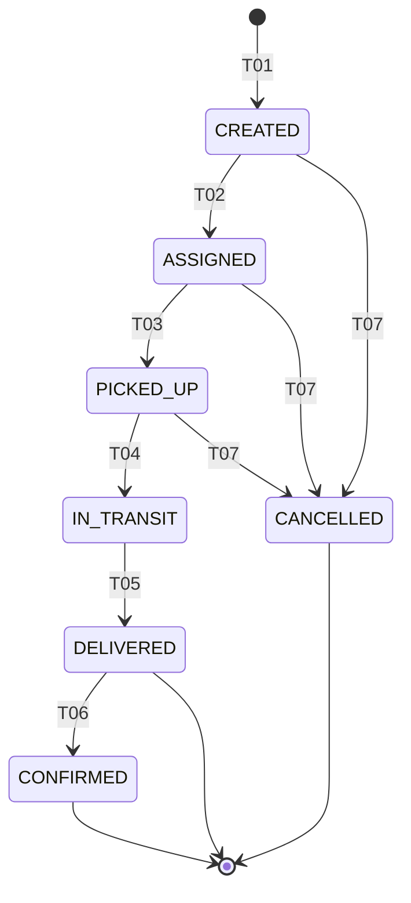

# Design Document: docs-as-blueprint

## Overview

Spec `docs-as-blueprint` biến `docs/` thành **bản thiết kế chính (blueprint)** — nguồn sự thật duy nhất (SSOT) cho BICAP. Tài liệu thiết kế này không tạo ra bất kỳ file nào dưới `docs/`, không sửa `AGENTS.md`, không sinh `tasks.md`. Nó **ràng buộc** giai đoạn tasks bằng cách chốt mọi quyết định mở (open decisions) trong yêu cầu, đặt ra schema front-matter, cấu trúc thư mục, hợp đồng các quality gate, và thứ tự thực thi.

Tài liệu thiết kế này phải được đọc cùng `requirements.md`. Mọi quyết định đều ghi rõ requirement IDs (`R1.1`, `R2.4`, ...) mà nó thoả mãn ở mục `Resolves`.

## How to Read This Document

Mỗi quyết định (`D1..D16`) tuân thủ format:

- **Question** — câu hỏi mở
- **Options considered** — các phương án đã cân nhắc
- **Decision** — phương án được chọn
- **Rationale** — vì sao
- **Consequences** — hệ quả (positive + negative + follow-up actions)
- **Resolves** — danh sách requirement IDs từ `requirements.md` mà quyết định này thoả mãn

Các phần phụ (Folder Skeleton, Schemas, Command Contracts, ...) được nhóm phía sau decision log để tránh trùng lặp khi nhiều decision tham chiếu cùng artefact.

## Design Constraints (recap)

- Vietnamese trong văn xuôi giải thích / rationale / summary.
- English cho: ID names, EARS keywords (`WHEN`, `IF`, `THEN`, `SHALL`, `WHERE`, `WHILE`), file paths, code blocks, regex, YAML/JSON keys, OpenAPI keys.
- Không tạo, sửa, xoá file ngoài `.kiro/specs/docs-as-blueprint/design.md` trong giai đoạn này.
- Không định nghĩa hành vi runtime mới; chỉ chốt cấu trúc tài liệu và quy ước.

---

## Decision Log

### D1. ID Numbering Scheme

**Question.** Khởi tạo số thứ tự cho từng loại ID (`R-*`, `NFR-*`, `BR-*`, `STM-*`, `API-*`, `ADR-*`, `GAP-*`) theo dense (`001, 002, 003, ...`) hay stride-10 (`010, 020, 030, ...`)?

**Options considered.**

- **Option A — Dense everywhere.** Mọi loại ID dùng `001, 002, 003, ...`. Đơn giản, không lãng phí số.
- **Option B — Stride-10 everywhere.** Mọi loại ID dùng `010, 020, 030, ...`. Cho phép chèn `R-FRM-015` giữa `R-FRM-010` và `R-FRM-020` mà không phải đánh số lại.
- **Option C — Hybrid.** Stride-10 cho các loại có insertion-rate cao (`R-*`, `NFR-*`, `BR-*`); dense cho các loại đóng-băng-sớm hoặc append-only (`STM-*`, `API-*`, `ADR-*`, `GAP-*`).

**Decision.** **Option C — Hybrid.**

- `R-*` (per-role functional requirement): **stride-10** — `R-ADM-010, R-ADM-020, ...`
- `NFR-*` (per-category): **stride-10** — `NFR-SCL-010, NFR-SCL-020, ...`
- `BR-*` (per-domain): **stride-10** — `BR-ORD-010, BR-ORD-020, ...`
- `STM-*-T<NN>` (transition): **dense** — `STM-SHP-T01, STM-SHP-T02, ...`
- `API-*` (per-module operationId): **dense** — `API-ORD-001, API-ORD-002, ...`
- `ADR-*`: **dense** — `ADR-001, ADR-002, ...`
- `GAP-*`: **dense** — `GAP-001, GAP-002, ...`

Insertion rule áp dụng cho **mọi loại ID không phân biệt stride**: cấp **next free number**, **không bao giờ renumber**. Với stride-10, chèn giữa `R-FRM-010` và `R-FRM-020` dùng `R-FRM-011..R-FRM-019` (1..9 là 9 slot dự phòng). Khi vượt 9 slot trong khoảng, dùng tiếp `R-FRM-021` không phải `R-FRM-013-bis`.

**Worked examples (rút từ Brief thực tế).**

- **Admin (5 bullets) →** `R-ADM-010, R-ADM-020, R-ADM-030, R-ADM-040, R-ADM-050`. Slot `R-ADM-011..019` dự phòng cho ambiguity của bullet 1, `R-ADM-021..029` cho bullet 2, ...
- **Farm Manager (~22 bullets) →** `R-FRM-010, R-FRM-020, ..., R-FRM-220`. Tổng 22 ID stride-10, range `010..220`.
- **Retailer (~17 bullets) →** `R-RTL-010, R-RTL-020, ..., R-RTL-170`.
- **Driver (~6 bullets) →** `R-DRV-010, R-DRV-020, ..., R-DRV-060`.
- **Shipping Manager (~9 bullets) →** `R-SHM-010, R-SHM-020, ..., R-SHM-090`.
- **Guest (3 bullets) →** `R-GST-010, R-GST-020, R-GST-030`.

**Worked insertion example.** Sau Brief Revision 2026-09-01, Farm Manager Brief thêm bullet "đăng ký hợp tác xã" giữa bullet 3 và bullet 4. Cấp `R-FRM-031` (slot kế tiếp trong khoảng 030..040). Không renumber `R-FRM-040..220`.

**Worked dense example.** ADR scaffold gieo `ADR-001..005` từ R10.4. ADR-006 (D8 quyết định) là ID kế tiếp. Khi cần chèn quyết định "Vault key management" giữa `ADR-003` (JWT) và `ADR-004` (Deposit), không chèn; cấp `ADR-007` cuối hàng đợi. Order theo timeline, không theo chủ đề.

**Rationale.**

- `R-*`, `NFR-*`, `BR-*` chịu pressure từ Brief revisions và domain refinements; stride-10 cho buffer vừa đủ mà không làm số ID dài quá 3 chữ số trong vòng đời thực tế (Farm Manager 22 bullets × 10 = 220, vẫn 3 chữ số).
- `STM-*-T<NN>` đã có 2 chữ số gắn cứng trong format (`T01..T99`); state machine ít khi vượt 20 transitions/lifecycle, dense là vừa đủ.
- `ADR-*`, `GAP-*` là chronologically-ordered registers, không có khái niệm "chèn giữa"; dense phản ánh đúng bản chất append-only.
- `API-*` neo trực tiếp vào `operationId` của OpenAPI; OpenAPI không có cơ chế chèn nên dense.

**Consequences.**

- (+) Brief revision không gây renumber.
- (+) Số ID 3 chữ số đủ dùng nguyên vòng đời sản phẩm.
- (−) Dev phải nhớ stride-10 vs dense theo loại; mitigation: `id-naming.md` phải nêu rõ allocation rule cho từng loại + ví dụ.
- (−) Người mới có thể nhầm `R-FRM-015` là "ID thứ 15" thay vì "chèn giữa 010 và 020"; mitigation: `doc-change-policy.md` cấm suy luận thứ tự từ giá trị số.
- Follow-up: `id-naming.md` (gieo trong Stage 1) phải đăng quy tắc trên kèm regex bất biến `^R-(ADM|FRM|RTL|DRV|SHM|GST)-\d{3}$`.

**Resolves.** R2.1, R2.2, R2.7, R2.10.

---

### D2. Brief Versioning

**Question.** Khi Brief được sửa đổi, lưu phiên bản như thế nào?

**Options considered.**

- **Option A — Append-only dated sections.** `_brief-source.md` chứa `## Brief Revision YYYY-MM-DD` xếp giảm dần thời gian; revision trên cùng là authoritative.
- **Option B — Git tag + Brief Revision Log table.** Mỗi revision là một git tag (`brief/2026-05-16`); một bảng trong `_brief-source.md` log tag và summary.
- **Option C — Per-revision sub-files.** `_brief-source-v1.md`, `_brief-source-v2.md`, ...; `_brief-source.md` là symlink/redirect tới bản mới nhất.

**Decision.** **Option A — Append-only dated sections.**

Cấu trúc cố định của `_brief-source.md`:

```markdown
---
title: BICAP Project Brief — Verbatim Source
ids: []
status: active
last-reviewed: 2026-05-16
language: vi
---

# BICAP Project Brief

> File này là nguồn nguyên thuỷ. Cấm sửa nội dung revision đã ban hành.
> Một revision mới = một section `## Brief Revision YYYY-MM-DD` được prepend
> trên cùng (sau front-matter và H1). Revision trên cùng là authoritative.

## Brief Revision 2026-05-16

### Admin
- (verbatim bullet 1)
- (verbatim bullet 2)
...

### Farm Manager
- ...

### Retailer
- ...

### Driver
- ...

### Shipping Manager
- ...

### Guest
- ...

### Non-Functional
- (scalability bullet)
- (blockchain bullet)
- (security/RBAC bullet)
```

**Re-validation protocol khi Brief revision được prepend.**

1. Tác giả tạo section `## Brief Revision YYYY-MM-DD` mới phía trên revision cũ.
2. Cập nhật `last-reviewed` trong front-matter.
3. Mỗi `R-*` chịu ảnh hưởng cập nhật field `brief-revision: YYYY-MM-DD` trong front-matter của file `R-*`.
4. Mỗi `R-*` không tham chiếu được nguyên văn trong revision mới → mở `GAP-*` "R-X obsoleted by Brief Revision YYYY-MM-DD" và đặt `status: deprecated` cho `R-*`.
5. Mỗi bullet mới trong revision mà không có `R-*` → vi phạm `docs:trace`.

**Rationale.**

- Phù hợp với kỳ vọng người Việt đọc tài liệu tuần tự (revision trên cùng = mới nhất).
- Một file duy nhất giữ toàn bộ lịch sử; agent đọc Brief không phải nhảy file/tag.
- Append-only chống xoá lịch sử ngẫu nhiên — đúng tinh thần SSOT.
- Tránh phụ thuộc git tag (Option B) vì nhiều agent local làm việc trên branch không có quyền tag.

**Consequences.**

- (+) Một file = một timeline; diff thân thiện trong PR.
- (+) Không cần tooling đặc biệt.
- (−) File phình theo thời gian; mitigation: archive revision cũ hơn 18 tháng vào `docs/_archive/brief-source-archive-YYYY.md` khi cần, ghi chú trong revision mới nhất.
- Follow-up: `doc-change-policy.md` phải có section "How to revise the Brief" mô tả 5 bước trên.

**Resolves.** R3.2, R15.1, R15.5.

---

### D3. RBAC Matrix Conditional Binding

**Question.** Một cell duy nhất trong ma trận RBAC có thể cần biểu diễn nhiều rule (ví dụ: ownership AND active subscription). Format nào?

**Options considered.**

- **Option A — One BR-\* per cell, split row.** Mỗi cell chỉ chấp nhận 1 BR-*. Đa rule → tách resource thành nhiều rows (`Farm.publish-listing.ownership-check`, `Farm.publish-listing.subscription-check`).
- **Option B — Joined BR-\* list in cell.** Cell value là `conditional:BR-FRM-007&BR-FRM-012` (ampersand-joined, implicit AND).
- **Option C — Policy reference.** Cell value là `conditional:POL-FRM-OWNER`; `POL-*` là loại ID mới compose BR-* bằng boolean logic tường minh.

**Decision.** **Option B — Joined BR-\* list in cell, ampersand AND.**

Grammar mở rộng cho cell value (ghi đè R7.3 với clarification, tracked in `id-naming.md`):

```
cell-value := "allow" | "deny" | conditional
conditional := "conditional:" br-id ( "&" br-id )*
br-id := "BR-" domain "-" digit{3}
```

**Worked example — Farm resource (full row excerpt).**

Giả định BR-* nguyên tử (mỗi BR là 1 thought, theo R5.5):

- `BR-FRM-010`: "User là owner của farm" (ownership check)
- `BR-FRM-020`: "Farm có active subscription" (subscription check)
- `BR-FRM-030`: "Farm không bị admin tạm khóa" (suspension check)

Ma trận:

| resource | admin | farm_manager | retailer | shipping_manager | driver | guest |
|---|---|---|---|---|---|---|
| `Farm.profile.read` | allow | conditional:BR-FRM-010 | allow | deny | deny | allow |
| `Farm.profile.update` | allow | conditional:BR-FRM-010&BR-FRM-030 | deny | deny | deny | deny |
| `Farm.publish-listing.create` | allow | conditional:BR-FRM-010&BR-FRM-020&BR-FRM-030 | deny | deny | deny | deny |
| `Farm.qr-export.generate` | allow | conditional:BR-FRM-010&BR-FRM-020 | deny | deny | deny | deny |

Đọc dòng `Farm.publish-listing.create` cho `farm_manager`: cho phép nếu là chủ farm **AND** đang có subscription **AND** không bị admin khóa. Mỗi BR-* riêng vẫn nguyên tử testable.

**Rationale.**

- Option A phình ma trận theo số rule, mất ý nghĩa "1 row = 1 capability".
- Option C thêm 1 loại ID (POL-*) → vi phạm R2.1 ("exactly seven types") trừ khi sửa requirement.
- Option B giữ R2.1 nguyên vẹn, mỗi BR-* vẫn nguyên tử (R5.5 không bị vi phạm vì AND nằm ở cell, không nằm trong statement của BR-*), và `&` là 1 token đơn không gây nhập nhằng với `,` đã dùng trong YAML.

**Consequences.**

- (+) Cell vẫn ngắn, machine-parseable bằng regex `^conditional:(BR-[A-Z]+-\d{3})(&BR-[A-Z]+-\d{3})*$`.
- (+) Mỗi BR-* nguyên tử, dễ test riêng, dễ trace tới R-*.
- (−) `R7.3` của `requirements.md` ghi `conditional:<BR-id>` (singular). Design này **mở rộng** R7.3 thành `conditional:<BR-id>(&<BR-id>)*`. Mở rộng phải được ghi vào `id-naming.md` như authoritative grammar, và ghi chú trong PR review checklist là "design D3 supersedes literal reading of R7.3 cell grammar".
- (−) Không hỗ trợ OR/NOT trong cell — lý do: OR thực chất là 2 cấp quyền khác nhau nên tách thành 2 rows; NOT cực hiếm và nếu cần phải mở GAP-* để thiết kế lại.
- Follow-up: `rbac-matrix.md` nhúng note "AND-only grammar, OR/NOT requires row split or GAP-*".

**Resolves.** R7.1, R7.2, R7.3, R7.4, R7.5, R7.6, R7.7, R5.5.

---

### D4. IoT Alerts Modeling

**Question.** Brief: "nhận thông báo nhiệt độ/độ ẩm/pH trong ngày". Mô hình hoá thế nào trong blueprint?

**Options considered.**

- **Option A — State machine `STM-IOTA`** trên entity IoTAlert (`PENDING → SENT → ACKED → DISMISSED`).
- **Option B — Notification rule** dưới dạng `BR-IOT-*` + delivery contract dưới `04-modules/iot.md`; **không** có state machine.
- **Option C — Both.** `STM-IOTA` cho lifecycle + `BR-IOT-*` cho cadence rule.

**Decision.** **Option B — Notification rule (no STM).**

`BR-IOT-010` (proposed text trong tasks phase):

> "Hệ thống ghi nhận sự kiện vượt ngưỡng (temperature/humidity/pH) làm `IoTAlert` record và gửi notification tới owner farm theo cadence mô tả trong `04-modules/iot.md`."

Cadence semantics — **both** triggers, ghi rõ trong `04-modules/iot.md`:

- **On-threshold breach** (immediate). Sensor reading vượt ngưỡng cấu hình → tạo alert + đẩy notification ngay.
- **Scheduled daily summary** (07:00 ICT theo timezone của farm). Tổng hợp toàn bộ readings 24h trước → gửi 1 digest dù không có breach.

Lý do "trong ngày" được hiểu là **per-day cadence**, bao gồm cả breach event lẫn daily digest. Field `last-reviewed` trong `iot.md` phải nhắc lại quyết định cadence này.

**Rationale.**

- "Trong ngày" trong Brief là **cadence** (tần suất), không phải **lifecycle** (vòng đời). Một thông báo không có nhiều state nghiệp vụ — gửi xong là xong.
- IoTAlert lifecycle `PENDING → SENT → ACKED → DISMISSED` không phản ánh quy trình kinh doanh; nó là implementation detail của notification queue.
- STM-IOTA không thoả tiêu chí R6.4 ("a code path performs a state transition") vì không có actor đổi trạng thái — chỉ có background worker đổi `PENDING → SENT`.
- Option B match `notifications` không phải lifecycle modeling: BR-* nguyên tử + module doc cadence.

**Consequences.**

- (+) Tránh STM-* giả tạo, giữ STM-* cho lifecycle thực sự (Shipment, Order, Season, Farm Approval, Subscription).
- (+) Cadence change (chuyển 07:00 → 06:00) là sửa BR-* + module doc, không phải redesign STM.
- (−) Không có visual table cho IoT alert flow; mitigation: `04-modules/iot.md` chứa 1 mermaid sequence diagram "sensor → backend → notification" thay thế.
- Follow-up: `02-domain/state-machines/` **không** chứa `iot-alert.md`. `04-modules/iot.md` chứa section `Cadence` với 2 trigger rule (on-breach, daily-digest).
- Follow-up: GAP-007 (xem D15) **resolved** ngay khi tasks phase ban hành `iot.md`, vì cadence được định nghĩa inline.

**Resolves.** R3.4, R5.4, R5.5, R6.1.

---

### D5. Frontend Route Guard Binding to RBAC Matrix

**Question.** Frontend `routes/` đang có RBAC tests; làm sao bind nó với `rbac-matrix.md` mà vẫn tôn trọng cell `conditional:BR-*`?

**Options considered.**

- **Option A — Generated JSON mirror.** Tooling sinh `frontend/src/rbac-matrix.json` từ `rbac-matrix.md`; route guard import JSON.
- **Option B — Static map kept in sync via `docs:check`.** Frontend có map tĩnh viết tay; `docs:check` so khớp role-vs-route giữa map và matrix; conflict → exit 1.
- **Option C — Role-only frontend guard, server-side conditional.** Frontend dùng role guard duy nhất (không quan tâm conditional); cells `conditional:BR-*` enforce 100% server-side; UI optimistic render, handle 403 từ API.

**Decision.** **Option C — Role-only frontend guard; conditional rules server-side; UI handles 403.**

Behavior contract:

- Frontend `routes/` chỉ kiểm tra `allow|deny` theo role-matrix-shape (resource-coarse-level): nếu một role có ít nhất 1 cell `allow` hoặc `conditional:*` cho resource → cho vào route.
- Conditional check (e.g., ownership, subscription, suspension) chạy **server-side** trong service layer.
- Component-level UI render lạc quan; khi user click action mà fail conditional → API trả 403; UI hiện toast tiếng Việt + log frontend.

Note: this decision is **design-only**. Implementation (matrix JSON, route guard refactor, 403 toast standard) defers to follow-up spec `frontend-rbac-binding`.

**Rationale.**

- Conditional checks phụ thuộc business state (ownership, subscription) mà frontend không sở hữu authoritative; static JSON không đủ.
- Generated JSON (Option A) cần tooling chưa có và tăng surface area của spec hiện tại — vi phạm scope (R13.1 không list tooling này).
- Option B đẩy compliance về `docs:check` mà chính `docs:check` chỉ là contract trong spec hiện tại; bootstrap circularity.
- Option C: server là single point of authorization (defense-in-depth); frontend chỉ làm UX layer. Đúng tinh thần `deny-by-default` trong AGENTS.md.

**Consequences.**

- (+) Không cần code change frontend trong spec hiện tại.
- (+) Bảo đảm `BR-*` luôn enforce dù frontend bug.
- (−) UI có thể flash action button rồi báo 403; mitigation: tasks-phase ADR-006 follow-up có thể nâng cấp lên Option A khi frontend-rbac-binding spec ra.
- (−) Người dùng cuối thấy "không cho phép" sau khi click — UX không tối ưu cho conditional dày.
- Follow-up: `rbac-matrix.md` ghi 1 dòng "Frontend enforces role-shape only; conditional cells enforced server-side. See design D5."

**Resolves.** R7.1, R7.2, R7.3, R7.6, R7.7, R12.7, R13.2, R16.2.

---

### D6. Brief-vs-Code Drift Discovery Procedure

**Question.** Làm sao phát hiện sai lệch giữa Brief, tài liệu, và mã nguồn một cách hệ thống trong giai đoạn tasks?

**Options considered.**

- **Option A — Manual walk + classify.** Người làm tasks duyệt thủ công code → cross-reference Brief → phân loại.
- **Option B — Automated AST/grep tooling.** Script quét controller paths, route paths, so khớp với Brief bullets.
- **Option C — Skip drift discovery; chỉ ghi GAP khi tình cờ phát hiện.**

**Decision.** **Option A — Manual procedure documented as a tasks-phase deliverable.**

Procedure (4 steps, executed once during Stage 3 — Brief intake):

1. **Walk code paths.** Liệt kê:
   - Mọi `@RequestMapping`/`@*Mapping` trong `backend/src/main/java/com/bicap/modules/*/controller/*.java` (dùng grep `@(Get|Post|Put|Patch|Delete)Mapping|@RequestMapping`).
   - Mọi route element trong `frontend/src/routes/` và mọi page export trong `frontend/src/pages/`.
2. **Cross-reference each path against the Brief.** Với mỗi path, hỏi: "Brief có nhắc tới capability này (qua role nào) không?".
3. **Classify each path** vào một trong 3 nhóm:
   - **BRIEF-SILENT** — code present, Brief absent. (Ví dụ giả định: `/api/v1/admin/feature-flags` tồn tại trong code nhưng Brief Admin không nhắc.)
   - **CODE-MISSING** — Brief present, code absent. (Ví dụ giả định: Brief Farm Manager có "đăng ký hợp tác xã" nhưng không có endpoint backend tương ứng.)
   - **CONTRADICTION** — both present but disagree. (Ví dụ thực tế: Brief Admin = "Admin deploys smart contracts"; `BLOCKCHAIN_ARCHITECTURE.md` = "validation/manage, not real deployment". Đây là `GAP-001`.)
4. **Deliverable.**
   - Path: `docs/00-overview/brief-code-drift-report.md`.
   - Front-matter: `title`, `ids: []`, `status: active`, `last-reviewed`, `language: bilingual`.
   - Sections (H2):
     - `## BRIEF-SILENT` — bảng `code-path | role-context | proposed-action (R-* with status: planned | open GAP-*)`.
     - `## CODE-MISSING` — bảng `brief-bullet | role | proposed-action (R-* with status: planned | open GAP-*)`.
     - `## CONTRADICTION` — bảng `code-path | brief-bullet | resolution-target (existing GAP-* or new GAP-*)`.
   - Mọi entry trong 3 bảng phải có `proposed-action` rõ ràng — hoặc trỏ đến `R-*` mới (nếu sẽ document hoá), hoặc mở `GAP-*` (nếu sẽ defer). Không entry rỗng.

**Rationale.**

- Option B yêu cầu tooling chưa tồn tại; spec này (R12.8, R13.2) đã hoãn tooling sang spec sau.
- Option C cho phép drift trôi qua không kiểm soát — vi phạm tinh thần SSOT.
- Option A thủ công nhưng có format cố định, sản phẩm (drift-report) tái sử dụng được khi tooling sau này tự sinh.

**Consequences.**

- (+) Mọi drift được ghi chính thức trong 1 file; reviewer dễ xác minh phạm vi spec.
- (+) Tasks-phase tự nhiên sinh thêm `R-*` (status: `planned`) hoặc `GAP-*` từ output → khoá lại drift.
- (−) Đòi 1 lượt review code thủ công ~22 modules; mitigation: chỉ list controller signatures + route paths, không đọc service logic.
- (−) Có thể bỏ sót drift ở edge cases (e.g., scheduled jobs không có controller path). Mitigation: `cron`/`@Scheduled` annotation cũng được walk bằng grep `@Scheduled`.
- Follow-up: tasks-phase Stage 3 có 1 task riêng "Generate brief-code-drift-report.md" với DoD = 3 bảng filled hoặc explicitly empty với note "no entries found".

**Resolves.** R3.6, R3.7, R12.10, R13.1, R15.5.

---

### D7. Language Strategy Beyond Prose

**Question.** Vietnamese OK cho prose. Cho từng artefact phụ (ADR titles, OpenAPI tags, BR statements, error codes, error messages, glossary), chọn ngôn ngữ nào?

**Options considered.** (Từng case có 3 options ngầm: vi, en, bilingual.)

**Decision.** Cố định bảng sau, áp dụng cho toàn bộ `docs/`:

| Artefact | Language | Lý do tooling/team |
|---|---|---|
| ADR titles | English | GitHub markdown rendering, VSCode tab title; Vietnamese trong body. |
| ADR body (`context`, `decision`, `consequences`) | Vietnamese | Reasoning thuộc team Việt; English mirror không bắt buộc. |
| OpenAPI `tags` | English | Swagger UI sort theo alphabet, mixed scripts gây sort sai. |
| OpenAPI `summary` (mỗi operation) | English | Một dòng dưới 80 chars; integrators ngoài team đọc. |
| OpenAPI `description` (mỗi operation) | Bilingual | English snippet đầu (≤2 sentences), Vietnamese đầy đủ phía sau, ngăn cách bằng dòng `---`. |
| `BR-*.statement` | Vietnamese | Domain reasoning là native; English alias optional ở field `notes`. |
| Error codes (machine) | English | Code identifier (`ORDER_DEPOSIT_INSUFFICIENT`); không dịch. |
| Error messages (user-facing) | Vietnamese | UI hiển thị end-user Việt. |
| Glossary entries | Bilingual | Theo R5.2 đã yêu cầu canonical English form + accepted Vietnamese form. |
| `R-*.title` | Vietnamese | Title đứng cạnh `source quote` Vietnamese. |
| `R-*.acceptance criteria` | English (EARS keywords) + Vietnamese predicate | EARS keyword (`WHEN`, `THE`, `SHALL`, ...) bắt buộc English; phần predicate sau keyword tiếng Việt. Ví dụ: `WHEN người dùng nhấn "Đặt cọc", THE Order_Service SHALL ghi giao dịch deposit vào DB.` |
| `STM-*-T<NN>` columns | English (column headers) + English/code values | `transition-id`, `from-state`, `to-state` là English code (uppercase enum). |
| Module doc section headings | English | Theo R8.2 đã định: `Purpose`, `Owns`, `Implements`, `Depends-on`, `API surface`, `Tests`, `Open gaps`. |
| File names | kebab-case English | `farm-manager.md`, `rbac-matrix.md`. |

**Rationale.**

- Tooling (Swagger UI, OpenAPI generators, GitHub search/anchor links) không Unicode-safe trong nhiều ngữ cảnh — giữ identifier-shaped artefact bằng English bảo đảm tooling-compat.
- Reasoning/prose là native team → Vietnamese giảm thiệt hại nhận thức (cognitive load).
- Bilingual ở những điểm giao thoa user/integrator (OpenAPI description, glossary) tránh phải duplicate tài liệu.

**Consequences.**

- (+) Spec viết duy nhất, không cần dịch toàn tài liệu.
- (+) Tooling-friendly — `docs:lint` regex hoạt động trên ASCII.
- (−) Reviewer mới phải biết bảng này; mitigation: `00-overview/structure.md` có 1 section "Language Strategy" link tới design D7.
- (−) Translator/copy-editor sau này phải tôn trọng phân nhánh; mitigation: language field trong front-matter (`vi|en|bilingual`) cảnh báo agent.
- Follow-up: `id-naming.md` thêm 1 ô regex riêng cho file naming (`^[a-z0-9][a-z0-9-]*\.md$`).

**Resolves.** R2.2, R2.5, R3.3, R5.2, R10.6, R12.1.

---

### D8. AGENTS.md Anchor Strategy

**Question.** Bốn anchor `docs/architecture/PROJECT_CONTEXT.md`, `docs/architecture/MODULES.md`, `docs/business/BUSINESS_RULES.md`, `docs/modules/` xử lý ra sao khi cấu trúc mới `00-..09-` ban hành?

**Options considered.**

- **Option A — Keep canonical at legacy paths; mirror under new structure.** Legacy 4 paths giữ là canonical; structure mới chứa link/mirror.
- **Option B — Move canonical to new paths; redirect stubs at legacy + atomic AGENTS.md update.** Canonical chuyển sang `03-architecture/context.md`, `03-architecture/component.md` (etc.), `02-domain/business-rules.md`, `04-modules/`; legacy paths trở thành redirect stubs với `status: superseded`; `AGENTS.md` cập nhật anchor paths trong cùng commit.

**Decision.** **Option B — Move canonical, redirect stubs, atomic AGENTS.md update.**

Mapping cụ thể (canonical → new path; legacy path → redirect stub):

| Legacy path (becomes redirect stub) | New canonical path |
|---|---|
| `docs/architecture/PROJECT_CONTEXT.md` | `docs/03-architecture/context.md` (C4 context + project mission section) |
| `docs/architecture/MODULES.md` | `docs/04-modules/README.md` (module index) |
| `docs/business/BUSINESS_RULES.md` | `docs/02-domain/business-rules.md` |
| `docs/modules/<file>.md` (mỗi file) | `docs/04-modules/<module>.md` (mỗi backend module riêng — xem D10) |

Atomic update yêu cầu (R14.2, R14.4):

- 1 PR (hoặc 1 task-output bundle) chứa: (1) các file di chuyển, (2) redirect stubs ở legacy paths, (3) AGENTS.md cập nhật 4 anchor paths sang new canonical paths.
- Không split thành 2 commits.

Redirect stub schema (xem D9 phần `redirect-stub`).

ADR liên quan: **ADR-006 — AGENTS.md Anchor Strategy** sẽ được tác giả trong tasks-phase Stage 5, ghi nhận decision này. Trước khi ADR-006 ở `status: accepted`, không thực hiện file-move (tuân R14.2).

**Rationale.**

- Option A giữ tài liệu cũ là "thật"; cấu trúc mới chỉ là façade — về lâu dài bị bypass, không phải SSOT.
- Option B đặt canonical ở đúng numbered structure → mọi navigation cuối cùng đều đến new structure.
- Risk của B (broken anchors trong tài liệu cũ tham chiếu legacy paths) được xử lý bằng redirect stubs: file vật lý còn tồn tại, front-matter `status: superseded`, body chứa duy nhất 1 link tới new path.
- Atomic update bảo đảm AGENTS.md không trỏ vào 404 — tuân R14.4, R14.5.

**Consequences.**

- (+) New structure là canonical; agents đọc tài liệu sẽ học cấu trúc mới ngay.
- (+) Legacy bookmarks vẫn resolve qua stub (1 click extra).
- (−) PR di chuyển file lớn, khó review; mitigation: tasks-phase chia thành 2 stages (Stage 2 module migration + Stage 6 enforcement) với checklist DoD rõ ràng.
- (−) Phải duy trì redirect stubs ít nhất 1 release cycle (R2.9, R14); mitigation: `gap-register.md` không cần entry riêng, `_archive/` không nhận stub vì stub vẫn `discoverable from current structure`.
- Follow-up: ADR-006 file scaffolded trong Stage 1 với `status: proposed`; promoted sang `status: accepted` ngay trước Stage 6 (atomic file-move stage).

**Resolves.** R14.1, R14.2, R14.3, R14.4, R14.5, R10.4, R10.6.

---

### D9. Front-matter Schema Final

**Question.** YAML schema chính xác cho từng loại file là gì?

**Options considered.** (Để ngắn — chỉ 1 lựa chọn được trình bày; alternatives bị loại vì thiếu trường bắt buộc theo R2.3, R2.4, R2.5, R2.6, R8.2, R10.6.)

**Decision.** Chốt schema từng loại file dưới đây. Mọi field không liệt kê là **forbidden**. Mọi field gắn `(required)` là bắt buộc; gắn `(optional)` là tuỳ chọn.

#### `R-*` file — under `01-requirements/functional/`

```yaml
---
title: <string, vi>           # required
ids:                          # required, list of R-* this file owns
  - R-<ROLE>-<NNN>
status: <draft|active|deprecated|superseded>   # required
last-reviewed: <YYYY-MM-DD>   # required
language: <vi|en|bilingual>   # required, expected vi
brief-revision: <YYYY-MM-DD>  # required, must match a section in _brief-source.md
---
```

Validation:

- `ids` regex per item: `^R-(ADM|FRM|RTL|DRV|SHM|GST)-\d{3}$`.
- `brief-revision` must equal one of the H2 dates in `_brief-source.md`.

#### `NFR-*` file — under `01-requirements/non-functional/`

```yaml
---
title: <string>               # required
ids:                          # required
  - NFR-<CAT>-<NNN>
status: <draft|active|deprecated|superseded|planned>   # required
last-reviewed: <YYYY-MM-DD>   # required
language: <vi|en|bilingual>   # required
---
```

`status: planned` allowed only here và chỉ khi body có `[TBD: target value]` (xem R4.2, R4.4).

#### `BR` file — `02-domain/business-rules.md` (single file)

```yaml
---
title: BICAP Business Rules — Atomic Catalog
ids:                          # required, list of every BR-* in this file
  - BR-<DOMAIN>-<NNN>
status: active                # required
last-reviewed: <YYYY-MM-DD>   # required
language: vi                  # required
---
```

#### `STM-*` file — under `02-domain/state-machines/<entity>.md`

```yaml
---
title: State Machine — <Entity>
ids:                          # required, every STM-<DOMAIN>-T<NN> in this file
  - STM-<DOMAIN>-T<NN>
status: <draft|active>        # required
last-reviewed: <YYYY-MM-DD>
language: en
entity: <PascalCase entity name>     # required, e.g., Shipment
valid-end-states:             # required, list of state enum values
  - DELIVERED
  - CANCELLED
---
```

#### API endpoint description — within `05-api/openapi.yaml` operation, mirrored as front-matter inside `05-api/<module>.md` if module API doc exists

For markdown wrapper file `05-api/<module>.md`:

```yaml
---
title: <Module> API — <Module Name>
ids:                          # required, every API-<MOD>-<NNN> declared here
  - API-<MOD>-<NNN>
status: <draft|active>
last-reviewed: <YYYY-MM-DD>
language: en
operationIds:                 # required, must mirror operationId in openapi.yaml
  - <camelCaseOperationId>
---
```

For OpenAPI operation level: `operationId` is required and must match the regex `^[a-z][a-zA-Z0-9]+$`. Each operation must include `x-doc-id: API-<MOD>-<NNN>` as an OpenAPI extension.

#### ADR file — `03-architecture/adrs/ADR-NNN-<slug>.md`

```yaml
---
id: ADR-<NNN>                 # required
title: <English title>        # required
status: <proposed|accepted|rejected|superseded>   # required
date: <YYYY-MM-DD>            # required, ISO calendar
decision: <one-sentence summary>   # required
context: <one-sentence summary>    # required
consequences: <one-sentence summary>   # required
supersedes: ADR-<NNN>         # optional
superseded-by: ADR-<NNN>      # optional
---
```

`status` lifecycle: `proposed → accepted | rejected`; `accepted → superseded` only.

#### GAP register entry — row in `09-governance/gap-register.md` (table form)

GAP-* không phải file riêng; là rows trong bảng dưới front-matter của `gap-register.md`. Table columns (per R12.3):

```text
| id | title | description | status | owner | target-date | related-r | related-br | related-stm |
```

- `id` regex: `^GAP-\d{3}$`.
- `status` ∈ `open|in-progress|resolved|wont-fix`.
- `target-date` ISO `YYYY-MM-DD` or `TBD`.
- `related-r`, `related-br`, `related-stm` là comma-separated lists (or `—`).

#### Module file — `04-modules/<module>.md`

```yaml
---
title: Module — <Module Name>
ids:                          # required, R-*, BR-*, STM-* this module OWNS
  - R-<ROLE>-<NNN>
  - BR-<DOMAIN>-<NNN>
  - STM-<DOMAIN>-T<NN>
status: <draft|active>        # required
last-reviewed: <YYYY-MM-DD>   # required
language: <vi|en|bilingual>   # required, expected bilingual
depends-on:                   # required, list of module names (or [] if none)
  - <module-name>
---
```

`ids` ownership rule (R8.4): mỗi ID xuất hiện trong `ids` của **đúng 1** module file. Trùng lặp = `docs:lint` failure.

#### Redirect stub — file ở legacy path sau khi Strategy B áp dụng

```yaml
---
title: <legacy filename — Superseded>
status: superseded            # required, fixed value
superseded-by: docs/<new-canonical-path>   # required, repo-relative path
last-reviewed: <YYYY-MM-DD>
language: en
---
```

Body của redirect stub: **đúng 1 dòng markdown link**, không chứa nội dung khác:

```markdown
This document moved to [docs/<new-canonical-path>](../<new-canonical-path>).
```

#### Common validation rules áp dụng cho mọi schema

- `last-reviewed` regex: `^\d{4}-\d{2}-\d{2}$`.
- `language` ∈ `vi|en|bilingual`.
- `status` allowed values vary by file type (see each schema).
- Front-matter phải mở `---` ở line 1 và đóng `---` trước nội dung body.
- File thiếu front-matter (trừ `_archive/` và `docs/README.md`) = `docs:lint` failure.

**Rationale.** Mỗi schema được chốt minimal nhưng đủ cho enforcement: regex per ID, status whitelist, ISO date, language enum. Các field `optional` (e.g., ADR `supersedes`) không xuất hiện trong file ban đầu nhưng được phép thêm về sau mà không vi phạm schema.

**Consequences.**

- (+) `docs:lint` có grammar đầy đủ để implement (sang spec sau).
- (+) Reviewer kiểm tra schema bằng regex/yamllint là đủ.
- (−) Schema cứng → mỗi field mới cần update spec (qua doc-change-policy).
- Follow-up: `id-naming.md` chứa toàn bộ regex; `doc-change-policy.md` mô tả quy trình thêm field.

**Resolves.** R2.3, R2.4, R2.5, R2.6, R2.7, R3.3, R4.2, R6.6, R8.2, R10.6, R12.3, R14.3.

---


### D10. Folder Skeleton with Placeholder Files

**Question.** Cấu trúc thư mục `docs/` đầy đủ và mỗi file phải được tasks-phase tạo bằng cách nào (empty front-matter / migrate from existing / scaffold from template)?

**Options considered.**

- **Option A — Lazy creation.** Tasks-phase chỉ tạo file khi dùng đến.
- **Option B — Eager skeleton.** Tasks-phase tạo toàn bộ skeleton ngay Stage 1, file rỗng vẫn có front-matter; sau đó các stage tiếp theo điền nội dung.

**Decision.** **Option B — Eager skeleton.**

Ký hiệu marker:

- `[NEW]` = `to-create-empty-with-front-matter` — file mới, chỉ chứa front-matter + section skeleton (H2 placeholders).
- `[MIG:<source>]` = `to-migrate-from-existing` — port từ source path đã có trong `docs/`.
- `[TPL:<template>]` = `to-scaffold-with-template` — tạo từ template (e.g., `_TEMPLATE.md`).

#### Full file tree

```text
docs/
├── README.md                                    [MIG:docs/README.md]   (giữ nguyên, top-level navigation)
├── 00-overview/
│   ├── vision.md                                [NEW]
│   ├── glossary.md                              [NEW]   (sẽ trỏ tới 02-domain/ubiquitous-language.md cho từ vựng domain)
│   ├── stakeholders.md                          [NEW]
│   ├── structure.md                             [NEW]   (mô tả 11 thư mục — 10 + _archive)
│   ├── migration-scope.md                       [NEW]
│   ├── non-goals.md                             [NEW]
│   └── brief-code-drift-report.md               [NEW]   (filled by D6 procedure)
├── 01-requirements/
│   ├── traceability-matrix.md                   [NEW]
│   ├── functional/
│   │   ├── _brief-source.md                     [NEW]   (Brief verbatim, D2 schema)
│   │   ├── admin.md                             [NEW]   (R-ADM-*)
│   │   ├── farm-manager.md                      [NEW]   (R-FRM-*)
│   │   ├── retailer.md                          [NEW]   (R-RTL-*)
│   │   ├── driver.md                            [NEW]   (R-DRV-*)
│   │   ├── shipping-manager.md                  [NEW]   (R-SHM-*)
│   │   └── guest.md                             [NEW]   (R-GST-*)
│   └── non-functional/
│       ├── scalability.md                       [NEW]   (NFR-SCL-*)
│       ├── performance.md                       [NEW]   (NFR-PRF-*)
│       ├── reliability.md                       [NEW]   (NFR-REL-*)
│       ├── security.md                          [NEW]   (NFR-SEC-*)
│       └── blockchain.md                        [NEW]   (NFR-BC-*)
├── 02-domain/
│   ├── ubiquitous-language.md                   [NEW]
│   ├── entities.md                              [NEW]
│   ├── relationships.md                         [NEW]
│   ├── business-rules.md                        [MIG:docs/business/BUSINESS_RULES.md → reformat as atomic BR-*]
│   └── state-machines/
│       ├── shipment.md                          [NEW]   (STM-SHP-T*)
│       ├── order.md                             [NEW]   (STM-ORD-T*)
│       ├── season.md                            [NEW]   (STM-SEA-T*)
│       ├── farm-approval.md                     [NEW]   (STM-FRMAPP-T*)
│       └── subscription.md                      [NEW]   (STM-SUB-T*)
├── 03-architecture/
│   ├── context.md                               [MIG:docs/architecture/PROJECT_CONTEXT.md + add C4 context mermaid]
│   ├── container.md                             [MIG:docs/architecture/ARCHITECTURE.md → C4 container view]
│   ├── component.md                             [MIG:docs/architecture/BACKEND_ARCHITECTURE.md → C4 component view]
│   ├── deployment.md                            [MIG:docs/architecture/PHASE8_PRODUCTION_HARDENING.md + deploy/README.md cross-reference]
│   ├── tech-stack.md                            [NEW]   (pinned versions từ pom.xml, package.json)
│   └── adrs/
│       ├── ADR-001-modular-monolith.md          [TPL:adr-template]   status: accepted (decision đã có)
│       ├── ADR-002-vechainthor-canonical-chain.md  [TPL:adr-template]   status: accepted (BLOCKCHAIN_ARCHITECTURE đã thể hiện)
│       ├── ADR-003-jwt-stateless-auth.md        [TPL:adr-template]   status: accepted
│       ├── ADR-004-deposit-backed-order-flow.md [TPL:adr-template]   status: proposed
│       ├── ADR-005-iot-ingest-authority.md      [TPL:adr-template]   status: proposed
│       └── ADR-006-agents-md-anchor-strategy.md [TPL:adr-template]   status: proposed → accepted (D8)
├── 04-modules/
│   ├── _TEMPLATE.md                             [TPL:new-module-template]   (replaces docs/modules/_TEMPLATE.md per D11/R8.2)
│   ├── README.md                                [MIG:docs/architecture/MODULES.md]   (module index)
│   ├── admin.md                                 [MIG:docs/modules/admin.md → new template]
│   ├── analytics.md                             [TPL:new-module-template]   (split from docs/modules/analytics-discovery.md)
│   ├── auth.md                                  [MIG:docs/modules/auth.md → new template]
│   ├── batch.md                                 [TPL:new-module-template]   (split from docs/modules/product-batch.md)
│   ├── common.md                                [TPL:new-module-template]   (cross-cutting infrastructure module)
│   ├── content.md                               [TPL:new-module-template]   (split from docs/modules/content-media.md)
│   ├── contract.md                              [TPL:new-module-template]   (split from docs/modules/listing-order-contract.md)
│   ├── discovery.md                             [TPL:new-module-template]   (split from docs/modules/analytics-discovery.md)
│   ├── farm.md                                  [MIG:docs/modules/farm.md → new template]
│   ├── iot.md                                   [TPL:new-module-template]   (carved from docs/modules/traceability-vechain-iot.md; cadence per D4)
│   ├── listing.md                               [TPL:new-module-template]   (split from docs/modules/listing-order-contract.md)
│   ├── logistics.md                             [TPL:new-module-template]   (split from docs/modules/logistics-shipment-driver.md)
│   ├── media.md                                 [TPL:new-module-template]   (split from docs/modules/content-media.md)
│   ├── order.md                                 [TPL:new-module-template]   (split from docs/modules/listing-order-contract.md)
│   ├── product.md                               [TPL:new-module-template]   (split from docs/modules/product-batch.md)
│   ├── retailer.md                              [MIG:docs/modules/retailer.md → new template]
│   ├── season.md                                [TPL:new-module-template]   (carved from docs/modules/season-cultivation.md)
│   ├── shipment.md                              [TPL:new-module-template]   (carved from docs/modules/logistics-shipment-driver.md)
│   ├── subscription.md                          [TPL:new-module-template]   (carved from docs/modules/subscription-payment.md)
│   ├── traceability.md                          [TPL:new-module-template]   (carved from docs/modules/traceability-vechain-iot.md)
│   ├── user.md                                  [MIG:docs/modules/user-rbac.md → new template]
│   └── vechain.md                               [TPL:new-module-template]   (carved from docs/modules/traceability-vechain-iot.md)
├── 05-api/
│   ├── conventions.md                           [NEW]   (path versioning, error envelope, pagination)
│   ├── authentication.md                        [NEW]   (JWT scheme + refresh contract)
│   ├── openapi.yaml                             [NEW]   (D12 scope only)
│   └── collections/
│       └── README.md                            [NEW]   (placeholder; existing Postman JSON migrated in follow-up spec)
├── 06-security/
│   ├── rbac-matrix.md                           [NEW]   (D3 grammar)
│   ├── threat-model.md                          [NEW]
│   └── key-management.md                        [NEW]
├── 07-operations/
│   ├── runbook-deploy.md                        [MIG:deploy/PRODUCTION_CHECKLIST.md → reformat]
│   ├── runbook-backup.md                        [MIG:deploy/backup-cron.example → markdown runbook form]
│   └── observability.md                         [MIG:docs/architecture/PHASE8_PRODUCTION_HARDENING.md observability section]
├── 08-testing/
│   ├── strategy.md                              [NEW]
│   └── coverage-by-requirement.md               [NEW]
├── 09-governance/
│   ├── id-naming.md                             [NEW]
│   ├── doc-change-policy.md                     [NEW]
│   ├── pr-checklist.md                          [MIG:.github/PR_CHECKLIST.md cross-reference, but canonical lives here]
│   ├── gap-register.md                          [NEW]   (seeded per D15)
│   ├── agents-md-amendment.md                   [NEW]
│   ├── pull-request-template.md                 [NEW]   (canonical doc; `.github/PULL_REQUEST_TEMPLATE.md` mirrors)
│   └── ci-check-spec.md                         [NEW]
└── _archive/
    ├── README.md                                [NEW]   (explains archive policy + 1 release cycle retention)
    ├── (legacy stubs from D8 redirect strategy live at their LEGACY paths, NOT here)
    └── (PHASE2_*, PHASE3_*, audit-* migrated from docs/archive/)   [MIG:docs/archive/*]
```

Notes:

- Bốn legacy paths (`docs/architecture/PROJECT_CONTEXT.md`, `docs/architecture/MODULES.md`, `docs/business/BUSINESS_RULES.md`, `docs/modules/*`) **không** chuyển vào `_archive/`; chúng được thay bằng redirect stubs tại chính legacy path (D8). `docs/architecture/` và `docs/business/` và `docs/modules/` vẫn tồn tại như "ghost folders" chứa stubs.
- 22 module files trong `04-modules/` ánh xạ 1-1 với 22 thư mục dưới `backend/src/main/java/com/bicap/modules/`: `admin, analytics, auth, batch, common, content, contract, discovery, farm, iot, listing, logistics, media, order, product, retailer, season, shipment, subscription, traceability, user, vechain`.
- `docs/agents/` (CONTEXT.md, SKILLS.md), `docs/api/` (legacy API md), `docs/audit/`, `docs/operations/`, `docs/security/`, `docs/testing/`, `docs/demo/`, `docs/evidence/`, `docs/legacy-notes/` được xử lý ở Stage 6: hoặc nội dung migrate vào numbered structure rồi original folder bị xoá, hoặc giữ là legacy folder chỉ chứa stubs. Quyết định cụ thể từng folder defer sang tasks-phase với constraint: bất kỳ file nào không trong 11 numbered folders sẽ flag bởi `docs:lint` (R1.4). Vì vậy mọi file phải hoặc chuyển hoặc thay bằng stub.

**Rationale.**

- Eager skeleton (Option B) giúp `docs:lint` chạy sạch ngay Stage 1 + ID linkage được khoá sớm.
- Marker rõ ràng (`[NEW]`/`[MIG:...]`/`[TPL:...]`) cho tasks-phase biết chính xác thao tác từng file.
- Mapping module 1-1 chính xác là source of truth cho ownership (R8.4).

**Consequences.**

- (+) Tasks-phase Stage 1 deliverable rõ ràng: tạo 100+ files với front-matter hợp lệ.
- (+) Mọi cross-reference (R-* → BR-* → STM-*) có file đích trước khi điền nội dung.
- (−) Stage 1 nặng ban đầu; mitigation: dùng template generator script (out-of-scope tooling) hoặc làm bằng tay theo thứ tự file tree.
- Follow-up: `_TEMPLATE.md` mới ở `04-modules/_TEMPLATE.md` thay thế `docs/modules/_TEMPLATE.md`; nội dung chi tiết ở D11 `Module Doc Template`.

**Resolves.** R1.1, R1.2, R1.3, R1.4, R1.5, R3.1, R4.1, R5.1, R5.6, R6.1, R8.1, R8.3, R9.1, R10.1, R10.4, R12.1, R13.1.

---

### D11. State Machine Table Format

**Question.** Format chính xác cho mỗi state machine table? Cột nào? Worked example cho `STM-SHP`?

**Options considered.**

- **Option A — Markdown table (R6.2 columns).** Plain markdown, không tooling.
- **Option B — Mermaid stateDiagram-v2.** Visualizable nhưng không liệt kê được trigger-event-or-api/guards/related-br ở kích thước node.
- **Option C — Both (table + mermaid diagram).** Table là canonical, mermaid là visualization aid.

**Decision.** **Option C — Markdown table is canonical; mermaid `stateDiagram-v2` accompanies for visualization only.**

#### Required columns (canonical per R6.2)

```text
| transition-id | from-state | to-state | triggered-by-role | trigger-event-or-api | guards | related-br |
```

Column semantics:

- `transition-id`: `STM-<DOMAIN>-T<NN>` (D1 dense).
- `from-state`, `to-state`: UPPER_SNAKE_CASE enum values.
- `triggered-by-role`: 1 trong 6 roles (`admin|farm_manager|retailer|shipping_manager|driver|guest`) hoặc `system` (cho automatic transitions).
- `trigger-event-or-api`: `API-<MOD>-<NNN>` hoặc tên domain event (e.g., `OrderDepositSettled`).
- `guards`: comma-separated `BR-*` references hoặc `—` nếu không có guard.
- `related-br`: comma-separated `BR-*` references (post-condition rules); cho phép overlap với `guards` nếu BR-* vừa là guard vừa là post-condition.

#### `valid-end-states` block

Đặt sau front-matter, dưới H2 `## Valid End States`:

```yaml
```yaml
valid-end-states:
  - DELIVERED
  - CANCELLED
```
```

(Block fenced YAML, không phải markdown list — cho parser tooling.) Hoặc thay thế bằng front-matter field `valid-end-states` (D9 đã chốt schema) — chọn front-matter làm canonical, body section repeat for human readability.

#### Worked example — `02-domain/state-machines/shipment.md`

Front-matter:

```yaml
---
title: State Machine — Shipment
ids:
  - STM-SHP-T01
  - STM-SHP-T02
  - STM-SHP-T03
  - STM-SHP-T04
  - STM-SHP-T05
  - STM-SHP-T06
  - STM-SHP-T07
status: draft
last-reviewed: 2026-05-16
language: en
entity: Shipment
valid-end-states:
  - DELIVERED
  - CONFIRMED
  - CANCELLED
---
```

Body — H2 sections in order: `## States`, `## Transitions`, `## Diagram`, `## Valid End States`.

`## Transitions` (the canonical table):

| transition-id | from-state | to-state | triggered-by-role | trigger-event-or-api | guards | related-br |
|---|---|---|---|---|---|---|
| STM-SHP-T01 | (none) | CREATED | shipping_manager | API-SHM-001 (POST /api/v1/shipments) | BR-SHP-010 | BR-SHP-010 |
| STM-SHP-T02 | CREATED | ASSIGNED | shipping_manager | API-SHM-002 (POST /api/v1/shipments/{id}/assign) | BR-SHP-020 | BR-SHP-020 |
| STM-SHP-T03 | ASSIGNED | PICKED_UP | driver | API-DRV-001 (PATCH /api/v1/shipments/{id}/status?to=PICKED_UP) | BR-SHP-030 | BR-SHP-030 |
| STM-SHP-T04 | PICKED_UP | IN_TRANSIT | driver | API-DRV-002 (PATCH /api/v1/shipments/{id}/status?to=IN_TRANSIT) | BR-SHP-040 | BR-SHP-040 |
| STM-SHP-T05 | IN_TRANSIT | DELIVERED | driver | API-DRV-003 (PATCH /api/v1/shipments/{id}/status?to=DELIVERED) | BR-SHP-050 | BR-SHP-050 |
| STM-SHP-T06 | DELIVERED | CONFIRMED | retailer | API-RTL-010 (POST /api/v1/orders/{id}/confirm-receipt) | BR-SHP-060 | BR-SHP-060,BR-ORD-070 |
| STM-SHP-T07 | CREATED,ASSIGNED,PICKED_UP | CANCELLED | shipping_manager | API-SHM-003 (POST /api/v1/shipments/{id}/cancel) | BR-SHP-070 | BR-SHP-070 |

Note row T07 có multi-value `from-state` (comma-separated) — biểu thị transition này hợp lệ từ 3 trạng thái nguồn. Đây là cú pháp cho phép trong canonical table.

`## Diagram` (mermaid, non-canonical, for human reading):

```text

```

`## Valid End States` (echo of front-matter for human reading):

- `DELIVERED`
- `CONFIRMED`
- `CANCELLED`

**Rationale.**

- Markdown table là canonical vì machine-parseable đơn giản (regex theo column count) và đáp ứng R6.2 đúng chữ.
- Mermaid là phụ trợ, không vi phạm "table is authoritative" (R6.2).
- `valid-end-states` ở front-matter cho `docs:lint` đọc nhanh; lặp lại ở body cho người đọc — không vi phạm DRY vì lint chỉ đọc front-matter.

**Consequences.**

- (+) Mỗi transition có ID stable; code có thể annotate `// STM-SHP-T03` ở method thực hiện transition.
- (+) Diagram giúp reviewer hiểu bigger picture nhanh.
- (−) Phải duy trì 2 representation (table + mermaid); mitigation: PR checklist nhắc "if you edit the table, update the diagram".
- Follow-up: `id-naming.md` ghi rõ `STM-<DOMAIN>-T<NN>` regex `^STM-[A-Z]+-T\d{2}$`.

**Resolves.** R6.1, R6.2, R6.3, R6.4, R6.5, R6.6.

---

### D12. OpenAPI Scaffold Scope

**Question.** Trong spec hiện tại, `openapi.yaml` scaffold cho những endpoint nào? Phần còn lại defer thế nào?

**Options considered.**

- **Option A — Full coverage.** Mọi controller backend được spec hoá ngay.
- **Option B — Auth + 2 lifecycle (order + shipment) + 1 placeholder per role.** Đủ chứng minh cấu trúc nhưng không "bọc" toàn bộ codebase.
- **Option C — Auth only.** Tối thiểu để demo schema.

**Decision.** **Option B — Auth + Order lifecycle + Shipment lifecycle + 1 placeholder per role workspace.**

In-scope endpoints (must appear in `openapi.yaml` with full request/response schemas):

#### Auth (5 ops)

- `POST /api/v1/auth/login` → `operationId: authLogin`, `x-doc-id: API-AUT-001`
- `POST /api/v1/auth/register` → `operationId: authRegister`, `x-doc-id: API-AUT-002`
- `POST /api/v1/auth/refresh` → `operationId: authRefresh`, `x-doc-id: API-AUT-003`
- `POST /api/v1/auth/logout` → `operationId: authLogout`, `x-doc-id: API-AUT-004`
- `GET /api/v1/auth/me` → `operationId: authMe`, `x-doc-id: API-AUT-005`

#### Order lifecycle (4 ops)

- `POST /api/v1/orders` → `orderCreate`, `API-ORD-001`
- `PATCH /api/v1/orders/{id}/status` → `orderUpdateStatus`, `API-ORD-002`
- `POST /api/v1/orders/{id}/cancel` → `orderCancel`, `API-ORD-003`
- `POST /api/v1/orders/{id}/deposit` → `orderDeposit`, `API-ORD-004`

#### Shipment lifecycle (3 ops)

- `POST /api/v1/shipments` → `shipmentCreate`, `API-SHM-001`
- `POST /api/v1/shipments/{id}/assign` → `shipmentAssign`, `API-SHM-002`
- `PATCH /api/v1/shipments/{id}/status` → `shipmentUpdateStatus`, `API-SHM-003`

#### Placeholder per role workspace (6 ops, one read-only endpoint each)

- `GET /api/v1/admin/dashboard-summary` → `adminDashboardSummary`, `API-ADM-001`
- `GET /api/v1/farm/profile` → `farmProfileRead`, `API-FRM-001`
- `GET /api/v1/retailer/discovery/listings` → `retailerListingsBrowse`, `API-RTL-001`
- `GET /api/v1/shipping-manager/dashboard-summary` → `shippingManagerDashboardSummary`, `API-SHM-010`
- `GET /api/v1/driver/assignments` → `driverAssignmentsList`, `API-DRV-010`
- `GET /api/v1/public/listings` → `guestListingsBrowse`, `API-GST-001`

Total in-scope: **18 operations**.

Out-of-scope (defer to follow-up spec **`docs-openapi-completion`**): mọi controller endpoint còn lại (analytics, content, media, contract dispute flow, traceability, vechain governance, IoT ingest, subscription payment, batch, ...). Spec follow-up phải reference name `docs-openapi-completion` trong `migration-scope.md` (R13.4).

`openapi.yaml` skeleton requirements (in-scope endpoints):

- OpenAPI version: `3.0.3` (compat với Swagger UI và editor.swagger.io).
- `info.title: BICAP API`, `info.version: 0.1.0` (bumped per change log policy in `conventions.md`).
- `servers` block: `https://{environment}.bicap.local/api/v1` với `environment` enum.
- Global `securitySchemes`: `bearerAuth` (JWT). Auth endpoints không yêu cầu `bearerAuth` cho login/register/refresh; còn lại yêu cầu.
- Tags: `auth`, `order`, `shipment`, `admin`, `farm`, `retailer`, `shipping-manager`, `driver`, `public`. Tags là English (D7).
- Mỗi operation có `summary` (English ≤80 chars), `description` (bilingual D7), `operationId`, `x-doc-id`, request/response schemas referencing `#/components/schemas/*`.
- Schemas in-scope (minimum): `LoginRequest`, `LoginResponse`, `RegisterRequest`, `User`, `OrderCreateRequest`, `OrderResponse`, `OrderStatus` (enum), `ShipmentCreateRequest`, `ShipmentResponse`, `ShipmentStatus` (enum), `Error` (envelope per `conventions.md`).
- `Error` schema: `{ code: string, message: string, details: object|null, traceId: string }`.

**Rationale.**

- 18 operations đủ chứng minh end-to-end (login → discover → order → deposit → ship → confirm) mà không phình spec.
- 1 placeholder per role bảo đảm mọi role có ít nhất 1 entry → không role nào bị "trống" trong matrix R-* ↔ API-*.
- Scope rõ ràng tránh tasks-phase trượt sang full coverage.

**Consequences.**

- (+) Reviewer có 1 file `openapi.yaml` ngắn, validate được bằng Swagger Editor ngay.
- (+) Follow-up spec `docs-openapi-completion` có baseline schema (Error, User, OrderStatus enum) để mở rộng.
- (−) Tài liệu API "không đầy đủ" trong vài tháng; mitigation: `migration-scope.md` ghi rõ `docs-openapi-completion` là next spec.
- Follow-up: `05-api/conventions.md` định nghĩa Error envelope, pagination cursor, idempotency-key header, version header — applies to all 18 ops và inherited by future ops.

**Resolves.** R9.1, R9.2, R9.3, R9.4, R9.5, R9.6, R9.7, R13.1, R13.4.

---

### D13. Quality Gate Command Contracts

**Question.** Hợp đồng cho 3 lệnh `docs:check`, `docs:lint`, `docs:trace` — input glob, exit code, stdout format, checks performed?

**Options considered.** (Mỗi lệnh có nhiều cách gói; chỉ option chốt được trình bày.)

**Decision.** Implementation **out of scope** cho spec này; tasks-phase scaffold stub script ở `scripts/docs/<command>.{sh,ps1}` chỉ in `"not implemented yet, see design D13"` và `exit 0`. Hợp đồng dưới đây là spec authoritative cho follow-up implementation spec.

#### `docs:check` — link checker

- **Purpose.** Kiểm tra mọi liên kết tương đối Markdown trong `docs/` và từ root files (`AGENTS.md`, `README.md`, `.github/`).
- **Input glob.**
  - `docs/**/*.md`
  - `AGENTS.md`
  - `README.md`
  - `.github/**/*.md`
- **Checks performed.**
  - Mọi `[text](relative-path.md)` resolve được tới file tồn tại.
  - Mọi `[text](relative-path.md#anchor)` anchor tồn tại trong file đích (anchor = slugified H1/H2/H3).
  - Bỏ qua absolute URL (`http://`, `https://`, `mailto:`).
- **Exit code.**
  - `0` = no broken links.
  - `1` = ≥1 broken link.
- **Stdout format.** Một dòng mỗi broken link:
  ```
  <source-file>:<line-number> -> <target>
  ```
  Ví dụ: `docs/04-modules/order.md:42 -> ./shipment.md#cancellation-policy`.
- **Sample failure message.**
  ```
  docs/06-security/rbac-matrix.md:15 -> ../02-domain/business-rules.md#br-frm-099
  docs/04-modules/iot.md:8 -> ./traceability-vechain-iot.md
  Found 2 broken links.
  ```

#### `docs:lint` — front-matter + ID format + uniqueness + folder placement

- **Purpose.** Validate front-matter schemas, ID regex, ID uniqueness, folder placement.
- **Input glob.**
  - `docs/**/*.md`
- **Checks performed.**
  - **(a) Front-matter present + matches schema** for every file requiring it (D9 schemas). Files exempt: `docs/_archive/**`, `docs/README.md`.
  - **(b) ID format compliance** — every value in any `ids:` list matches its regex from `id-naming.md`.
  - **(c) ID uniqueness** — no ID appears in `ids:` list of more than one file across `docs/`.
  - **(d) No loose docs** — no `*.md` directly under `docs/` except `docs/README.md`. (R1.4)
  - **(e) Status whitelist** — `status` value within file-type-specific allowed set (D9).
  - **(f) `last-reviewed` ISO format.**
  - **(g) Redirect stub conformance** — files at the four AGENTS.md anchor legacy paths must have `status: superseded` + `superseded-by` (D8/D9).
- **Exit code.**
  - `0` = clean.
  - `1` = ≥1 violation.
- **Stdout format.**
  ```
  <file-path>: <violation-type>: <details>
  ```
  Violation types: `missing-front-matter`, `invalid-id-format`, `duplicate-id`, `loose-doc`, `invalid-status`, `invalid-date`, `redirect-stub-malformed`.
- **Sample failure messages.**
  ```
  docs/01-requirements/functional/admin.md: invalid-id-format: 'R-ADM-1' does not match ^R-(ADM|FRM|RTL|DRV|SHM|GST)-\d{3}$
  docs/04-modules/order.md: duplicate-id: 'BR-ORD-010' also declared in docs/02-domain/business-rules.md
  docs/random-note.md: loose-doc: file directly under docs/ is forbidden except docs/README.md
  docs/architecture/PROJECT_CONTEXT.md: redirect-stub-malformed: missing 'superseded-by' front-matter key
  Found 4 violations.
  ```

#### `docs:trace` — traceability completeness

- **Purpose.** Validate that mỗi Brief bullet → ≥1 R-*, mỗi R-* → ≥1 test reference.
- **Input glob.**
  - `docs/01-requirements/functional/_brief-source.md`
  - `docs/01-requirements/functional/*.md`
  - `docs/01-requirements/traceability-matrix.md`
- **Checks performed.**
  - **(a) Brief bullet coverage.** Mọi `- ` bullet trong section `## Brief Revision <YYYY-MM-DD>` mới nhất phải có ≥1 row trong `traceability-matrix.md` với non-empty `R-*` cell.
  - **(b) R-* coverage.** Mọi R-* trong front-matter `ids:` của files dưới `01-requirements/functional/` phải có ≥1 row trong `traceability-matrix.md` với non-empty `test-file` cell.
  - **(c) API-* existence.** Mọi `API-*` referenced trong R-* file's `related-api` phải có matching `x-doc-id` trong `openapi.yaml` (R9.7).
- **Exit code.**
  - `0` = full coverage.
  - `1` = ≥1 blocking gap.
- **Stdout format.**
  ```
  <brief-bullet-or-id>: missing <R-*|test|API-*>
  ```
- **Sample failure messages.**
  ```
  brief-bullet[Farm Manager #14]: missing R-*
  R-RTL-070: missing test-file
  R-ADM-030.related-api[API-ADM-099]: missing operationId in openapi.yaml
  Found 3 gaps.
  ```

#### Stub script template (Windows + bash)

`scripts/docs/docs-check.ps1`:

```powershell
Write-Host "docs:check — not implemented yet, see design D13"
exit 0
```

`scripts/docs/docs-check.sh`:

```bash
#!/usr/bin/env bash
echo "docs:check — not implemented yet, see design D13"
exit 0
```

Tương tự cho `docs-lint.{ps1,sh}` và `docs-trace.{ps1,sh}`. Tasks-phase tạo 6 files này.

**Rationale.**

- Stub-then-implement separation tôn trọng R12.8 + R13.2 (implementation out of scope).
- Hợp đồng đầy đủ (input glob, exit code, stdout format, checks, sample) cho follow-up spec implement không phải đoán.
- 3 lệnh không overlap nhiệm vụ: `docs:check` = links, `docs:lint` = format, `docs:trace` = coverage.

**Consequences.**

- (+) PR-checklist (`pr-checklist.md`) tham chiếu được 3 lệnh ngay từ Stage 6.
- (+) CI (sang follow-up) có blueprint cài đặt cụ thể.
- (−) Stub luôn `exit 0` → chưa enforce gì; mitigation: PR template (D9 schema xong) yêu cầu reviewer chạy 3 lệnh thủ công.
- Follow-up: spec name `docs-quality-gates-impl` cho implementation; ghi vào `migration-scope.md` out-of-scope list.

**Resolves.** R12.8, R13.2, R16.3, R1.4, R2.7, R6.6, R9.7, R11.3, R11.4.

---

### D14. Mermaid Diagram Conventions

**Question.** Tooling diagram cho `03-architecture/context.md|container.md|component.md` và state machine diagrams?

**Options considered.**

- **Option A — Plain mermaid `flowchart` with C4-style boxes.** Renders trong GitHub, VSCode, Kiro IDE native.
- **Option B — Mermaid `C4Context`/`C4Container`/`C4Component`.** Đúng C4 grammar nhưng experimental, render không đồng nhất.
- **Option C — PlantUML embedded as image.** Cần PlantUML server hoặc preprocessing; markdown raw không render.

**Decision.** **Option A — Plain mermaid `flowchart` with C4-style box conventions.**

#### Style guide

Node shapes (mermaid-flowchart syntax):

- `[Person]` — square brackets cho human user/role.
  ```
  user[End User<br/>(Role)]
  ```
- `(System)` — round brackets cho system in scope (BICAP itself).
  ```
  bicap(BICAP Backend)
  ```
- `[[External System]]` — double square brackets cho external integration.
  ```
  vechain[[VeChainThor Network]]
  ```
- `[(Database)]` — cylinder for data store.
  ```
  mysql[(MySQL DB)]
  ```
- `>Note]` — asymmetric for annotations.
- Arrows: `-->` solid synchronous; `-.->` dashed async/event; `==>` thick critical path.

Color (subgraph fills) — class definitions ở cuối mỗi diagram:

```
classDef person fill:#fef3c7,stroke:#92400e
classDef system fill:#dbeafe,stroke:#1e40af
classDef external fill:#e5e7eb,stroke:#374151
classDef datastore fill:#dcfce7,stroke:#166534
```

State diagrams: `stateDiagram-v2` (xem D11).

Sequence diagrams (when needed in module docs): `sequenceDiagram`.

#### Worked example — `03-architecture/context.md`

```text
```mermaid
flowchart LR
    farmer[Farm Manager<br/>(role: farm_manager)]:::person
    retailer[Retailer<br/>(role: retailer)]:::person
    driver[Driver<br/>(role: driver)]:::person
    guest[Guest Visitor<br/>(role: guest)]:::person

    bicap(BICAP Platform):::system

    vechain[[VeChainThor]]:::external
    iot[[IoT Sensor Gateway]]:::external
    smtp[[SMTP / Notification Service]]:::external

    farmer -->|manage farm, list products| bicap
    retailer -->|browse, order, deposit| bicap
    driver -->|pickup, deliver, prove| bicap
    guest -->|browse public marketplace| bicap

    bicap -.->|submit proof tx| vechain
    bicap -.->|ingest sensor reading| iot
    bicap -.->|deliver notification| smtp

    classDef person fill:#fef3c7,stroke:#92400e
    classDef system fill:#dbeafe,stroke:#1e40af
    classDef external fill:#e5e7eb,stroke:#374151
```
```

**Rationale.**

- Plain `flowchart` renders native trong GitHub markdown preview, VSCode default extension, Kiro IDE — không cần plugin.
- `C4Context` mermaid grammar (Option B) là beta, render fallback inconsistent giữa renderers.
- PlantUML (Option C) yêu cầu image generation step → tooling dependency mới, vi phạm scope.

**Consequences.**

- (+) Mọi diagram trong PR review hiển thị trực tiếp.
- (+) Style guide nhỏ gọn, dễ tuân thủ.
- (−) Không có C4 metadata strict (e.g., `Person`, `System` semantic labels); mitigation: dùng convention naming `[Role<br/>(role: <role>)]` và class definitions để giữ ý nghĩa C4.
- Follow-up: `00-overview/structure.md` link tới D14 cho convention reference; `03-architecture/component.md` reuse cùng class definitions.

**Resolves.** R10.1, R10.2.

---

### D15. GAP Register Seeding

**Question.** Những GAP-* nào phải gieo từ Stage 1? Range reservation?

**Options considered.**

- **Option A — Seed only known issue (smart-contract-deploy).** R12.4 yêu cầu tối thiểu 1 entry.
- **Option B — Seed all NFR placeholders + known mismatches + AGENTS.md anchor decision.** Front-load mọi gap đã biết; tasks-phase chỉ thêm khi runtime drift xuất hiện.

**Decision.** **Option B — Eager seed.**

#### Seed entries (rows in `09-governance/gap-register.md`)

| id | title | description | status | owner | target-date | related-r | related-br | related-stm |
|---|---|---|---|---|---|---|---|---|
| GAP-001 | Admin smart-contract deploy mismatch | Brief Admin = "deploy smart contracts"; `BLOCKCHAIN_ARCHITECTURE.md` = "validation/manage, not real deployment". Resolution requires either Brief revision or product change. | open | TBD | TBD | R-ADM-* (TBD when admin.md authored) | — | — |
| GAP-002 | AGENTS.md anchor strategy decision | Strategy A vs B for legacy anchors. Resolved when ADR-006 reaches `status: accepted`. | open | TBD | TBD | — | — | — |
| GAP-003 | NFR-SCL target user volume / RPS / autoscaling thresholds | Brief mentions AWS/GCP/Docker/Redis but no target numbers. NFR-SCL-* placeholder `[TBD: target value]` per R4.5. | open | TBD | TBD | — | — | — |
| GAP-004 | NFR-PRF latency targets | API p95 latency, page load time targets unspecified. | open | TBD | TBD | — | — | — |
| GAP-005 | NFR-REL uptime / RPO / RTO | Reliability targets unspecified. | open | TBD | TBD | — | — | — |
| GAP-006 | NFR-BC TPS / confirmation latency / IoT batch size | Brief mentions VeChainThor concurrency without numbers. NFR-BC-* placeholder per R4.6. | open | TBD | TBD | — | — | — |
| GAP-007 | IoT alert cadence definition | Resolved by D4 (Option B). When tasks-phase publishes `04-modules/iot.md` with cadence sections (on-breach + daily-digest), set status: `resolved`. | resolved | — | (set on resolve) | — | BR-IOT-010 | — |

Note: `GAP-007` được seed với status `resolved` ngay từ đầu vì D4 đã chốt. Ghi nhận trong gap-register để giữ ID không bị tái sử dụng.

#### ID range reservation

- `GAP-001..050`: **reserved for blueprint-creation phase** (this spec + immediate follow-ups). Tasks-phase không vượt quá `GAP-050` cho gaps phát hiện trong Stage 3 (D6 drift report).
- `GAP-051..`: **reserved for runtime-discovered gaps** during normal product lifecycle.

Drift entries (D6) sẽ chiếm range `GAP-008..050`. Một entry placeholder note trong gap-register.md text:

> "GAP-008..GAP-050 reserved for entries produced by `brief-code-drift-report.md` (Stage 3). Entries are appended in order of discovery."

#### Resolution rules

- Khi `GAP-*` chuyển `status: resolved`, không xoá row; cập nhật `target-date` thành ngày resolve thực tế và optional thêm cột note về ADR/PR resolves.
- `wont-fix` requires linked ADR explaining decision.

**Rationale.**

- Eager seed bảo đảm mọi reviewer thấy ngay 7 gap đã biết — không bị che giấu.
- Range reservation phân tách "design-time gaps" với "runtime gaps" cho dễ thống kê.
- GAP-007 seed resolved giữ ID range liên tục, tránh nhảy số.

**Consequences.**

- (+) Reviewer Stage 1 đã thấy 7 entries → tin tưởng tài liệu thật thà về unknown.
- (+) `docs:trace` không phải chấp nhận `[TBD]` infinite — mỗi placeholder neo vào 1 GAP-* tracking it.
- (−) Một số GAP có owner/target-date `TBD` lâu dài; mitigation: `doc-change-policy.md` đặt rule "GAP open >1 release cycle without owner = escalation in PR review".
- Follow-up: tasks-phase Stage 1 deliverable = `gap-register.md` với 7 rows seeded.

**Resolves.** R3.7, R4.5, R4.6, R4.8, R12.3, R12.4, R12.10, R15.3, R15.5.

---

### D16. Task Ordering Preview

**Question.** Tasks-phase chia stages thế nào? Mỗi stage unlock gì?

**Options considered.**

- **Option A — One mega-stage.** Tất cả task song song.
- **Option B — Six sequential stages with explicit dependencies.** Mỗi stage có DoD trước khi sang stage kế.

**Decision.** **Option B — 6 stages, sequential with clear unlocks.**

#### Stage 1 — Foundation

- **Purpose.** Scaffold 10-folder structure + governance scaffolding + `_TEMPLATE.md` mới.
- **Outputs.**
  - Toàn bộ folder tree (D10) tạo xong với placeholder front-matter.
  - `09-governance/id-naming.md` chứa toàn bộ regex (R-*, NFR-*, BR-*, STM-*, API-*, ADR-*, GAP-*).
  - `09-governance/doc-change-policy.md` mô tả allocation rules (D1), Brief revision protocol (D2), schema change rules.
  - `09-governance/gap-register.md` seeded với 7 entries (D15).
  - `04-modules/_TEMPLATE.md` mới (D11 sections).
  - `00-overview/structure.md` mô tả 11 folders.
- **Unlocks.** Mọi stage tiếp theo có ID stable + folder để write into.
- **DoD.** `docs:lint` (manual run, stub out OK) qua front-matter check trên skeleton.

#### Stage 2 — Module Migration

- **Purpose.** Port 16 module docs cũ sang 22 module files mới theo template (`04-modules/`).
- **Outputs.**
  - 22 module files (D10 mapping) populated với content carved from old 16 files + new template sections.
  - `04-modules/README.md` (module index, replacing `MODULES.md`).
- **Unlocks.** Ownership map cho R-*/BR-*/STM-* (mỗi ID rồi sẽ thuộc 1 module).
- **DoD.** Mỗi module file có `Owns` section liệt kê ID placeholder; `Implements` section tham chiếu đến package thật.

#### Stage 3 — Brief Intake

- **Purpose.** Ingest Brief; sinh R-*; phát hiện drift.
- **Outputs.**
  - `01-requirements/functional/_brief-source.md` chứa Brief verbatim (D2 schema, Revision 2026-05-16).
  - 6 R-* files (admin, farm-manager, retailer, driver, shipping-manager, guest) populated với R-* IDs (D1 numbering) + EARS criteria.
  - `00-overview/brief-code-drift-report.md` (D6 procedure outputs).
  - GAP-008..GAP-N entries appended cho drift items.
- **Unlocks.** Scope clarity cho Stage 4 cross-references.
- **DoD.** Mọi Brief bullet có ≥1 R-*; drift report có 3 sections (BRIEF-SILENT/CODE-MISSING/CONTRADICTION) với entries hoặc explicit "no entries".

#### Stage 4 — Glue (Domain + RBAC)

- **Purpose.** Khoá domain definitions cross-referenced bởi R-*.
- **Outputs.**
  - `02-domain/state-machines/{shipment,order,season,farm-approval,subscription}.md` (5 files, D11 format).
  - `06-security/rbac-matrix.md` (D3 grammar, 6-role columns).
  - `02-domain/business-rules.md` reformatted as atomic BR-* (R5.5 split rule).
  - `02-domain/ubiquitous-language.md`, `02-domain/entities.md`, `02-domain/relationships.md`.
- **Unlocks.** Mọi `related-br`, `related-stm` reference trong R-* resolve được.
- **DoD.** RBAC matrix không có cell rỗng; mọi `conditional:BR-*` (D3) reference tồn tại trong business-rules.md.

#### Stage 5 — Contract & Decisions

- **Purpose.** Machine-readable contract + architecture decisions.
- **Outputs.**
  - `05-api/openapi.yaml` (D12 scope: 18 ops).
  - `05-api/conventions.md`, `05-api/authentication.md`, `05-api/collections/README.md`.
  - 6 ADR files (`ADR-001..005` từ R10.4 + `ADR-006` D8) với front-matter D9 schema. ADR-001/002/003 status `accepted` (decision đã được thể hiện trong code/Brief), ADR-004/005 `proposed`, ADR-006 `proposed`.
  - `01-requirements/traceability-matrix.md` scaffold (rows per Brief bullet, R-* cell filled, test-file cell `[TBD]` until Stage 6).
  - `03-architecture/{context,container,component,deployment,tech-stack}.md` (D14 mermaid).
- **Unlocks.** Frontend/integrator có hợp đồng + decision rationale; PR template có `OpenAPI delta` field meaningful.
- **DoD.** `openapi.yaml` validate qua editor.swagger.io; ADR-006 đạt `status: accepted` trước Stage 6 file-move.

#### Stage 6 — Enforcement

- **Purpose.** Wire AGENTS.md + PR template + stub scripts.
- **Outputs.**
  - `AGENTS.md` cập nhật anchor paths (atomic với D8 file-moves).
  - Redirect stubs ở 4 legacy paths (D9 redirect-stub schema).
  - `.github/PULL_REQUEST_TEMPLATE.md` (mirror của `09-governance/pull-request-template.md`).
  - `scripts/docs/{docs-check,docs-lint,docs-trace}.{sh,ps1}` (6 stub files, D13).
  - `09-governance/agents-md-amendment.md` ghi cụ thể diff áp dụng vào AGENTS.md.
  - `09-governance/ci-check-spec.md` ghi spec cho follow-up CI hard-enforcement.
- **Unlocks.** Doc-code sync protocol active từ next PR onward.
- **DoD.** All 4 AGENTS.md anchor paths resolve qua redirect stubs hoặc updated content; PR template fields (`Doc IDs touched`, `Gap entries`, `OpenAPI delta`, `Tests`, `RBAC impact`) appear trong `.github/PULL_REQUEST_TEMPLATE.md`.

#### Cross-stage rules

- Mỗi stage có thể overlap với stage trước cho minor fixes nhưng không skip backward.
- Nếu Stage 3 phát hiện drift dẫn tới R-* mới sau Stage 4 đã viết business-rules.md, BR-* có thể append; không vi phạm sequential vì append-only không phá vỡ ID stability.
- Tasks-phase chuyển 6 stages này thành numbered tasks list (e.g., `1.1`, `1.2`, `2.1`, ...) với explicit `depends-on: <task-id>` field per task.

**Rationale.**

- 6 stages khoá thứ tự dependency: structure → ownership → scope → domain → contract → enforcement.
- Mỗi stage có DoD đo được; reviewer biết khi nào stage "done".
- Sequential giảm rework: nếu Stage 4 viết business-rules.md trước khi R-* tồn tại (Stage 3), BR-* có thể không đúng granularity.

**Consequences.**

- (+) Tasks-phase có template list để biên dịch thành tasks numbered.
- (+) Mỗi DoD là gate review; không pass thì stage tiếp không bắt đầu.
- (−) Long critical path; mitigation: Stage 1 + Stage 2 có thể chạy song song khi infrastructure khác nhau (folders vs migration content).
- Follow-up: `tasks.md` chuyển 6 stages thành các sections; each task includes `Resolves: <Rx.y>` (mirror this design's pattern).

**Resolves.** R13.1, R13.3, R13.5, R16.1, R16.2, R16.3, R16.4, plus indirectly: every R that depends on a deliverable produced in one of the 6 stages.

---

## Reference Sections

### A. Module Doc Template (canonical content for `04-modules/_TEMPLATE.md`)

```markdown
---
title: Module — <Module Name>
ids: []
status: draft
last-reviewed: <YYYY-MM-DD>
language: bilingual
depends-on: []
---

# <Module Name>

## Purpose

<Vietnamese: business capability the module owns. 1-3 sentences.>

## Owns

- R-*: <list of R-IDs this module is the canonical owner of>
- BR-*: <list>
- STM-*: <list>

## Implements

- **Backend package**: `backend/src/main/java/com/bicap/modules/<module>/`
- **Controllers**: <FQN list>
- **Services**: <FQN list>
- **Entities**: <FQN list>
- **Repositories**: <FQN list>
- **Frontend pages**: `frontend/src/pages/<…>/`
- **Frontend services**: `frontend/src/services/<…>.js`

## Depends-on

- <other module names>

## API surface

- API-<MOD>-<NNN> → `operationId` in `docs/05-api/openapi.yaml`

## Tests

- R-<ROLE>-<NNN> → <relative test path>

## Open gaps

- GAP-<NNN>
```

### B. ADR Template (canonical content for ADR scaffolds)

```markdown
---
id: ADR-<NNN>
title: <English title>
status: proposed
date: <YYYY-MM-DD>
decision: <one-sentence>
context: <one-sentence>
consequences: <one-sentence>
---

# ADR-<NNN> — <Title>

## Status

proposed

## Context

<Vietnamese: situation requiring a decision.>

## Decision

<Vietnamese: what is decided.>

## Consequences

- Positive: …
- Negative: …
- Follow-up: …

## Alternatives Considered

- …
```

### C. Cross-Reference Map (decision → requirement coverage)

Quick verification table: every requirement appears in `Resolves` of at least one decision.

| Requirement | Resolved by |
|---|---|
| R1.1..R1.5 | D8, D10 |
| R2.1..R2.10 | D1, D7, D9 |
| R3.1..R3.8 | D2, D6, D7, D9, D10 |
| R4.1..R4.8 | D9, D10, D15 |
| R5.1..R5.6 | D3, D4, D9, D10 |
| R6.1..R6.6 | D4, D9, D10, D11, D13 |
| R7.1..R7.7 | D3, D5 |
| R8.1..R8.5 | D9, D10, "Module Doc Template" |
| R9.1..R9.7 | D10, D12, D13 |
| R10.1..R10.7 | D7, D8, D10, D14, "ADR Template" |
| R11.1..R11.6 | D13, D16 (Stage 5 deliverable) |
| R12.1..R12.10 | D5, D7, D9, D13, D15, D16 |
| R13.1..R13.5 | D5, D10, D12, D13, D16 |
| R14.1..R14.5 | D8, D9 |
| R15.1..R15.5 | D2, D6, D9, D15 |
| R16.1..R16.4 | D5, D13, D16 |

Mọi requirement có ít nhất một decision phủ. Nếu tasks-phase phát hiện gap mới, mở GAP-* trong range `GAP-008..050` (D15).

### D. Glossary of Design Terms

- **Stride-10 numbering** (D1) — IDs allocated `010, 020, 030, ...`; insertion uses unused slots in the gap.
- **Dense numbering** (D1) — IDs allocated `001, 002, 003, ...`; no gap.
- **Brief Revision** (D2) — append-only dated section in `_brief-source.md`; topmost is authoritative.
- **Conditional cell** (D3) — RBAC matrix cell value `conditional:BR-*&BR-*&...`, ampersand-AND.
- **Redirect stub** (D8, D9) — file at legacy path with `status: superseded`, body = single Markdown link to new canonical path.
- **Eager skeleton** (D10) — Stage 1 creates all files with valid front-matter before any content is filled.
- **Canonical table + visualization aid** (D11) — markdown table is enforcement source; mermaid diagram is reading aid.
- **Stub-then-implement** (D13) — script files exist with placeholder body; full implementation deferred to follow-up spec.

---

## End of Design

This design document chốt 16 quyết định D1..D16 và phủ toàn bộ R1.1..R16.4 trong `requirements.md`. Tasks-phase nhận tài liệu này làm input authoritative; mọi sai lệch trong tasks-phase phải mở GAP-* (range `GAP-008..050`) hoặc sửa design qua doc-change-policy.
