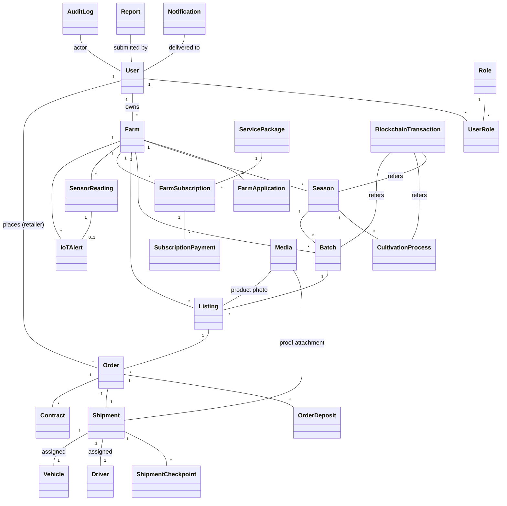
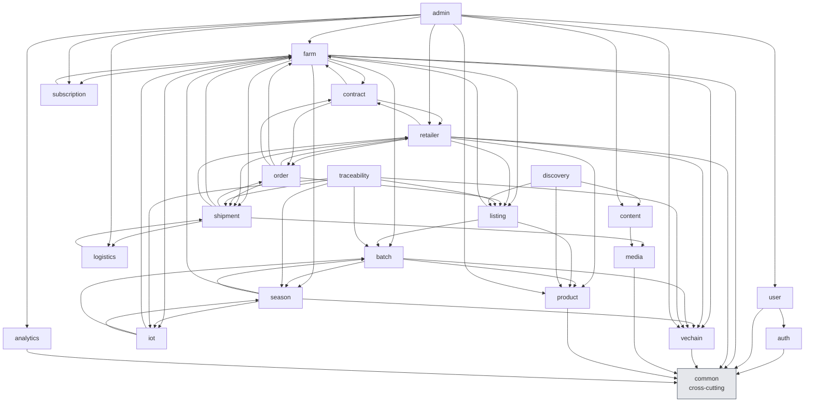

# Entity Relationships

Cross-entity relationships and module dependencies. Entity definitions in [`entities.md`](entities.md). Mermaid diagrams use plain `classDiagram` per design D14.

## Entity Relationship Diagram

## Module Dependencies

Direction: arrow source `depends-on` arrow target. Cross-cutting `common` module is the bottom layer. Each module's `depends-on` field in [`../04-modules/`](../04-modules/) MUST match this diagram.

## Cross-Module Relationships Summary

| From module | To module | Nature |
|---|---|---|
| farm | season | one-to-many; farm owns seasons |
| farm | batch | one-to-many; farm owns batches |
| farm | listing | one-to-many; farm publishes listings |
| farm | iot | one-to-many; sensor readings per farm |
| season | batch | one-to-many; season produces batches |
| season | vechain | proof commit on season events |
| batch | product | many-to-one; batch references catalog product |
| listing | order | one-to-many; listings receive orders |
| order | shipment | one-to-one; each order one shipment |
| shipment | logistics | many-to-one; shipping manager owns logistics |
| shipment | media | one-to-many; proof images per shipment |
| iot | farm | many-to-one; readings tied to farm |
| traceability | vechain, iot, batch, season, listing, shipment | facade; aggregates trace data |
| admin | every module | governance writes |
| common | (none) | provides notification, audit, observability primitives |

## Cardinality Notation

- `1` — exactly one
- `*` — zero or more
- `1..*` — one or more
- `0..1` — zero or one (optional)

## Lifecycle Coupling

State machines are not tightly coupled across entities, but several transitions trigger events listened by other modules:

- `STM-SHP-T06` (Shipment CONFIRMED) → fires `STM-ORD-T06` (Order DELIVERED)
- `STM-ORD-T04` (Order REJECTED) → fires deposit refund job → eventually `STM-ORD-T08` (REFUNDED)
- `STM-SEA-T02` (Season COMMITTED) → updates `season.blockchainTxHash`; consumed by traceability/listing modules
- `STM-FRMAPP-T04` (Farm SUSPENDED) → enforces `BR-FRM-030` for all farm-write actions
