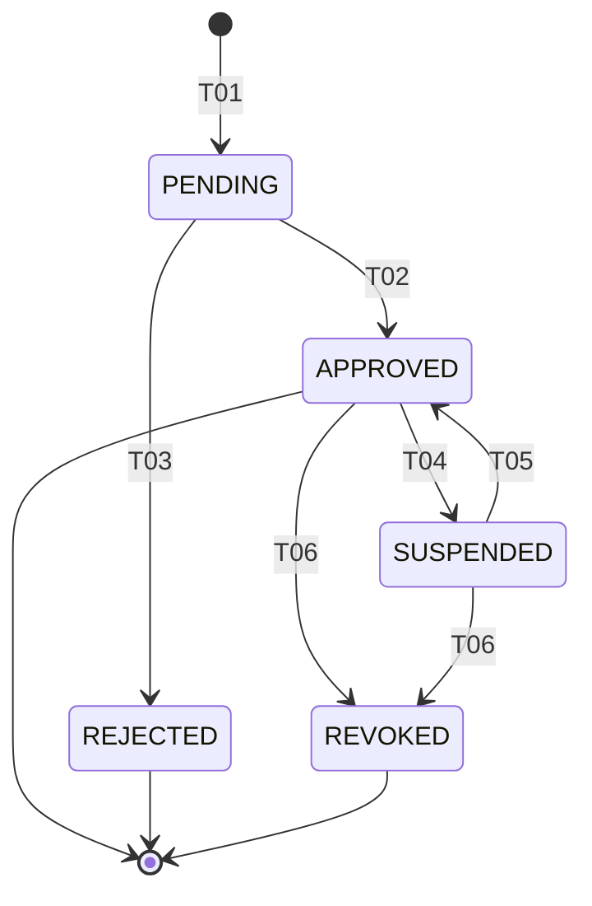

# State Machine — FarmApplication

Farm registration workflow inferred from `R-ADM-020`. New farms start `PENDING`; admin approves/rejects; later admin can suspend or revoke an active farm.

## States

| State | Description |
|---|---|
| `PENDING` | Farm registered, awaiting admin review |
| `APPROVED` | Farm active, can use platform |
| `REJECTED` | Farm rejected; user can resubmit later |
| `SUSPENDED` | Admin paused the farm; data preserved, write actions denied (BR-FRM-030) |
| `REVOKED` | Admin permanently revoked the farm |

## Transitions

| transition-id | from-state | to-state | triggered-by-role | trigger-event-or-api | guards | related-br |
|---|---|---|---|---|---|---|
| STM-FRMAPP-T01 | (none) | PENDING | farm_manager | POST /api/v1/farms (self-register) | BR-FRMAPP-010 | BR-FRMAPP-010 |
| STM-FRMAPP-T02 | PENDING | APPROVED | admin | POST /api/v1/admin/farms/{id}/approve | BR-FRMAPP-020 | BR-FRMAPP-020 |
| STM-FRMAPP-T03 | PENDING | REJECTED | admin | POST /api/v1/admin/farms/{id}/reject | BR-FRMAPP-030 | BR-FRMAPP-030 |
| STM-FRMAPP-T04 | APPROVED | SUSPENDED | admin | POST /api/v1/admin/farms/{id}/suspend | BR-FRMAPP-040 | BR-FRMAPP-040, BR-FRM-030 |
| STM-FRMAPP-T05 | SUSPENDED | APPROVED | admin | POST /api/v1/admin/farms/{id}/reinstate | BR-FRMAPP-050 | BR-FRMAPP-050 |
| STM-FRMAPP-T06 | APPROVED, SUSPENDED | REVOKED | admin | POST /api/v1/admin/farms/{id}/revoke | BR-FRMAPP-060 | BR-FRMAPP-060 |

## Diagram

## Valid End States

- `APPROVED`
- `REJECTED`
- `REVOKED`

`SUSPENDED` is a transient state (not an end state); admin must reinstate or revoke.
