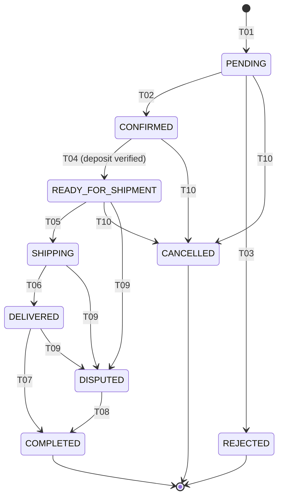

# State Machine — Order

Order lifecycle. **Order has two orthogonal status dimensions** (kept separate in code for operational clarity):

1. **Order workflow status** — `OrderStatus` enum. Tracks the order's progression through farm acceptance, shipping, delivery, dispute, completion.
2. **Payment status** — `OrderPaymentStatus` enum. Tracks deposit/payment lifecycle independently.

This SM was rewritten on 2026-05-16 to match the actual code (`OrderService.STATUS_TRANSITIONS` map and `OrderPaymentStatus` enum) per drift report. Earlier versions of this document modelled `DEPOSIT_PAID` as an `OrderStatus` value; in the running system, payment is a separate dimension.

## Workflow States (`OrderStatus`)

| State | Description |
|---|---|
| `PENDING` | Order created by retailer, awaiting farm decision |
| `CONFIRMED` | Farm manager accepted the order; quantities reserved |
| `REJECTED` | Farm manager rejected the order; deposit refund triggered |
| `READY_FOR_SHIPMENT` | Deposit paid AND order accepted; eligible for shipment creation |
| `SHIPPING` | Shipment in progress (driver picked up or in transit) |
| `DELIVERED` | Goods delivered (mirrors shipment `DELIVERED`) |
| `DISPUTED` | Issue raised on shipment or by retailer; awaits resolution |
| `COMPLETED` | Order closed; deposit released |
| `CANCELLED` | Cancelled before fulfillment |

## Payment States (`OrderPaymentStatus`)

| State | Description |
|---|---|
| `UNPAID` | Initial state; deposit not paid |
| `DEPOSIT_PAID` | Retailer paid deposit; gateway callback verified |
| `RELEASED` | Deposit released to farm after dispute window closes |
| `PAID` | Full payment received (where applicable, future flows) |

Payment transitions are not enumerated as `STM-ORD-T*` rows because they fire on gateway callbacks rather than via the workflow state machine. They are governed by `BR-ORD-080` and the `OrderDepositGatewayCallback` flow.

## Transitions (Workflow)

| transition-id | from-state | to-state | triggered-by-role | trigger-event-or-api | guards | related-br |
|---|---|---|---|---|---|---|
| STM-ORD-T01 | (none) | PENDING | retailer | API-ORD-001 (POST /api/v1/orders) | BR-ORD-010 | BR-ORD-010 |
| STM-ORD-T02 | PENDING | CONFIRMED | farm_manager | API-ORD-002 (PATCH /api/v1/orders/{id}/status?to=CONFIRMED) | BR-ORD-040 | BR-ORD-040 |
| STM-ORD-T03 | PENDING | REJECTED | farm_manager | API-ORD-002 (PATCH /api/v1/orders/{id}/status?to=REJECTED) | BR-ORD-050 | BR-ORD-050 |
| STM-ORD-T04 | CONFIRMED | READY_FOR_SHIPMENT | system | event: DepositGatewayCallbackVerified (after API-ORD-004) | BR-ORD-020, BR-ORD-060 | BR-ORD-020, BR-ORD-060 |
| STM-ORD-T05 | READY_FOR_SHIPMENT | SHIPPING | system | event: ShipmentPickedUp (mirrors STM-SHP-T03/T04) | BR-ORD-060 | BR-ORD-060 |
| STM-ORD-T06 | SHIPPING | DELIVERED | system | event: ShipmentDelivered (mirrors STM-SHP-T05) | BR-ORD-070 | BR-ORD-070, BR-SHP-050 |
| STM-ORD-T07 | DELIVERED | COMPLETED | farm_manager, admin, system | API-ORD-002 with to=COMPLETED OR scheduled `OrderDisputeWindowJob` close | BR-ORD-100 | BR-ORD-070, BR-ORD-100 |
| STM-ORD-T08 | DISPUTED | COMPLETED | admin, farm_manager | API-ORD-002 with to=COMPLETED after dispute resolution | BR-ORD-110 | BR-ORD-110 |
| STM-ORD-T09 | READY_FOR_SHIPMENT, SHIPPING, DELIVERED | DISPUTED | retailer, farm_manager, shipping_manager, driver | API-ORD-002 with to=DISPUTED OR mirrored from STM-SHP-T08/T09/T10/T11 | BR-ORD-090 | BR-ORD-090 |
| STM-ORD-T10 | PENDING, CONFIRMED, READY_FOR_SHIPMENT | CANCELLED | retailer | API-ORD-003 (POST /api/v1/orders/{id}/cancel) | BR-ORD-030 | BR-ORD-030 |
| STM-ORD-T11 | (terminal) | (terminal) | — | REJECTED, COMPLETED, CANCELLED accept no outgoing transitions | — | — |
| STM-ORD-T12 | (any) | (DEPOSIT released) | system | scheduled `OrderDisputeWindowJob` after dispute window closes | BR-ORD-080 | BR-ORD-080 |

`STM-ORD-T09` and `T10` accept multi-value `from-state`. `T11` is a terminal sentinel. `T12` is a payment-side transition that fires alongside workflow transitions and updates `OrderPaymentStatus` from `DEPOSIT_PAID` to `RELEASED`.

## Diagram

## Valid End States

- `COMPLETED`
- `CANCELLED`
- `REJECTED`

`DISPUTED` is **not** an end state — it must resolve to `COMPLETED` per `STM-ORD-T08`.

## Synchronization with `STM-SHP`

When a shipment transitions, the parent order's workflow state may be updated automatically by `ShipmentService.syncOrderStatus()`:

| Shipment transition | Order side effect |
|---|---|
| STM-SHP-T03 (PICKED_UP) | If order is `READY_FOR_SHIPMENT` → `SHIPPING` (STM-ORD-T05) |
| STM-SHP-T04 (IN_TRANSIT) | If order is `READY_FOR_SHIPMENT` → `SHIPPING` (STM-ORD-T05) |
| STM-SHP-T05 (DELIVERED) | Order → `DELIVERED` (STM-ORD-T06) |
| STM-SHP-T07 (CANCELLED) | If order in `READY_FOR_SHIPMENT`/`SHIPPING` → revert to `READY_FOR_SHIPMENT` |
| STM-SHP-T08 (REJECTED retailer) | Order → `DISPUTED` (STM-ORD-T09) |
| STM-SHP-T09 (DISPUTED) | Order → `DISPUTED` (STM-ORD-T09) |
| STM-SHP-T10 (ESCALATED) | Order → `DISPUTED` (STM-ORD-T09) |
| STM-SHP-T11 (REJECTED shipping_manager) | Order → `DISPUTED` (STM-ORD-T09) |

## Code Reference

- Enum: `backend/src/main/java/com/bicap/core/enums/OrderStatus.java`
- Payment enum: `backend/src/main/java/com/bicap/core/enums/OrderPaymentStatus.java`
- Workflow transitions: `OrderService.STATUS_TRANSITIONS` map
- Auth-by-transition: `OrderService.assertCanChangeStatus()`
- Cancel guard: `OrderService.canCancel()`
- Sync: `ShipmentService.syncOrderStatus()`
- Auto-close: `OrderDisputeWindowJob.closeEligibleOrders()`
