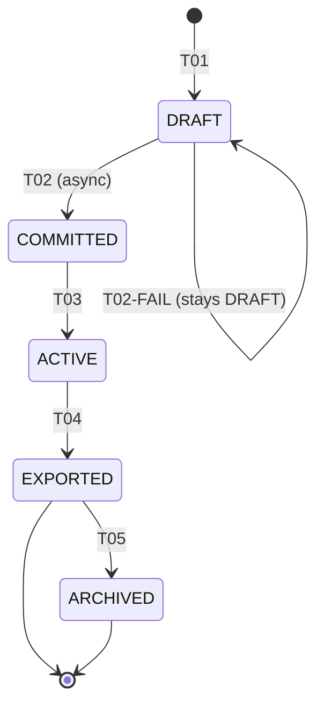

# State Machine — Season

Cultivation Season lifecycle. Each transition that writes to blockchain is async with idempotency-key = `seasonId`.

## States

| State | Description |
|---|---|
| `DRAFT` | Just created; blockchain commit pending |
| `COMMITTED` | Blockchain commit succeeded; season identity locked on-chain |
| `ACTIVE` | Cultivation in progress; processes can be added/updated |
| `EXPORTED` | Season exported, QR generated, marketable |
| `ARCHIVED` | Historical record only, no further mutations |

## Transitions

| transition-id | from-state | to-state | triggered-by-role | trigger-event-or-api | guards | related-br |
|---|---|---|---|---|---|---|
| STM-SEA-T01 | (none) | DRAFT | farm_manager | POST /api/v1/seasons | BR-SEA-010, BR-FRM-010 | BR-SEA-010 |
| STM-SEA-T02 | DRAFT | COMMITTED | system | event: BlockchainCommitSuccess | BR-SEA-020 | BR-SEA-020 |
| STM-SEA-T03 | COMMITTED | ACTIVE | farm_manager | PATCH /api/v1/seasons/{id}/start | BR-SEA-030 | BR-SEA-030 |
| STM-SEA-T04 | ACTIVE | EXPORTED | farm_manager | POST /api/v1/seasons/{id}/export | BR-SEA-040 | BR-SEA-040 |
| STM-SEA-T05 | EXPORTED | ARCHIVED | farm_manager, admin | PATCH /api/v1/seasons/{id}/archive | BR-SEA-050 | BR-SEA-050 |

Failed blockchain commit (`STM-SEA-T02-FAIL`): season stays `DRAFT`; `BlockchainTransaction` row gets `status = FAILED`. Admin can retry via `R-ADM-050` governance API.

## Diagram

## Valid End States

- `EXPORTED`
- `ARCHIVED`
