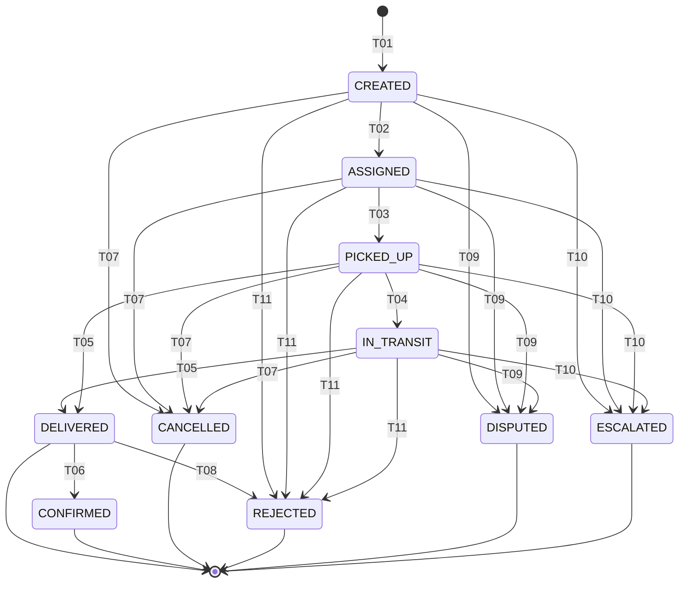

# State Machine — Shipment

Authoritative state machine for `Shipment` entity. Markdown table is canonical; mermaid diagram is reading aid only. Implementations in `modules/shipment` MUST reject any transition not listed below.

This SM was extended on 2026-05-16 to reflect dispute and reject branches present in code (`ShipmentStatus.{REJECTED,DISPUTED,ESCALATED}` enum values) per drift report 2026-05-16. Previously the table only listed the happy path T01–T07; transitions T08–T12 capture the actually-implemented dispute/reject/escalation flow.

## States

| State | Description |
|---|---|
| `CREATED` | Shipment created from an eligible order, no driver/vehicle yet |
| `ASSIGNED` | Driver and vehicle assigned by shipping manager |
| `PICKED_UP` | Driver scanned QR at farm and confirmed pickup |
| `IN_TRANSIT` | Goods en route to retailer |
| `DELIVERED` | Driver confirmed handover to retailer |
| `CONFIRMED` | Retailer confirmed receipt with photo proof (planned, not yet in code — see drift item) |
| `CANCELLED` | Shipment cancelled by shipping manager (only valid before `DELIVERED`) |
| `REJECTED` | Retailer refused the delivery (post-handover); fires `Order.DISPUTED` upstream |
| `DISPUTED` | Issue raised during shipment lifecycle; awaits admin/shipping-manager review |
| `ESCALATED` | Driver/shipping-manager escalates a dispute to admin governance |

## Transitions

| transition-id | from-state | to-state | triggered-by-role | trigger-event-or-api | guards | related-br |
|---|---|---|---|---|---|---|
| STM-SHP-T01 | (none) | CREATED | shipping_manager | API-SHM-001 (POST /api/v1/shipments) | BR-SHP-010 | BR-SHP-010 |
| STM-SHP-T02 | CREATED | ASSIGNED | shipping_manager | API-SHM-002 (POST /api/v1/shipments/{id}/assign) | BR-SHP-020 | BR-SHP-020 |
| STM-SHP-T03 | ASSIGNED | PICKED_UP | driver | POST /api/v1/shipments/{id}/pickup OR PATCH /api/v1/shipments/{id}/status?to=PICKED_UP | BR-SHP-030 | BR-SHP-030 |
| STM-SHP-T04 | PICKED_UP | IN_TRANSIT | driver | API-SHM-003 (PATCH /api/v1/shipments/{id}/status?to=IN_TRANSIT) | BR-SHP-040 | BR-SHP-040 |
| STM-SHP-T05 | IN_TRANSIT, PICKED_UP | DELIVERED | driver | API-SHM-003 (PATCH /api/v1/shipments/{id}/status?to=DELIVERED) | BR-SHP-050 | BR-SHP-050 |
| STM-SHP-T06 | DELIVERED | CONFIRMED | retailer | POST /api/v1/orders/{id}/confirm-delivery (planned for shipment-level confirmation) | BR-SHP-060 | BR-SHP-060, BR-ORD-070 |
| STM-SHP-T07 | CREATED, ASSIGNED, PICKED_UP, IN_TRANSIT | CANCELLED | shipping_manager | POST /api/v1/shipments/{id}/cancel OR API-SHM-003 with to=CANCELLED | BR-SHP-070 | BR-SHP-070 |
| STM-SHP-T08 | DELIVERED | REJECTED | retailer | POST /api/v1/shipments/{id}/reject | BR-SHP-080 | BR-SHP-080, BR-ORD-090 |
| STM-SHP-T09 | CREATED, ASSIGNED, PICKED_UP, IN_TRANSIT | DISPUTED | shipping_manager, driver | API-SHM-003 with to=DISPUTED | BR-SHP-090 | BR-SHP-090, BR-ORD-090 |
| STM-SHP-T10 | CREATED, ASSIGNED, PICKED_UP, IN_TRANSIT | ESCALATED | shipping_manager, driver | API-SHM-003 with to=ESCALATED | BR-SHP-100 | BR-SHP-100, BR-ORD-090 |
| STM-SHP-T11 | CREATED, ASSIGNED, PICKED_UP, IN_TRANSIT | REJECTED | shipping_manager | API-SHM-003 with to=REJECTED | BR-SHP-110 | BR-SHP-110, BR-ORD-090 |
| STM-SHP-T12 | (terminal) | (terminal) | — | DELIVERED, CANCELLED, REJECTED, DISPUTED, ESCALATED are end states; no further transitions allowed | — | — |

`STM-SHP-T05`, `T07`, `T09`, `T10`, `T11` accept multi-value `from-state` — the transition is valid from any of the listed source states.

`STM-SHP-T12` is a sentinel row stating that the listed terminal states accept no outgoing transitions. Code path: `ShipmentService.validateTransition()` `case DELIVERED, CANCELLED, REJECTED, DISPUTED, ESCALATED -> false`.

## Diagram

## Valid End States

- `DELIVERED`
- `CONFIRMED`
- `CANCELLED`
- `REJECTED`
- `DISPUTED`
- `ESCALATED`

Any code path leading the entity outside this set is a `docs:lint` violation.

## Code Reference

- Enum: `backend/src/main/java/com/bicap/core/enums/ShipmentStatus.java`
- Validation: `ShipmentService.validateTransition()`
- Order sync: `ShipmentService.syncOrderStatus()` — when shipment goes to `REJECTED`/`DISPUTED`/`ESCALATED`, parent order moves to `DISPUTED` (see STM-ORD-T09)
