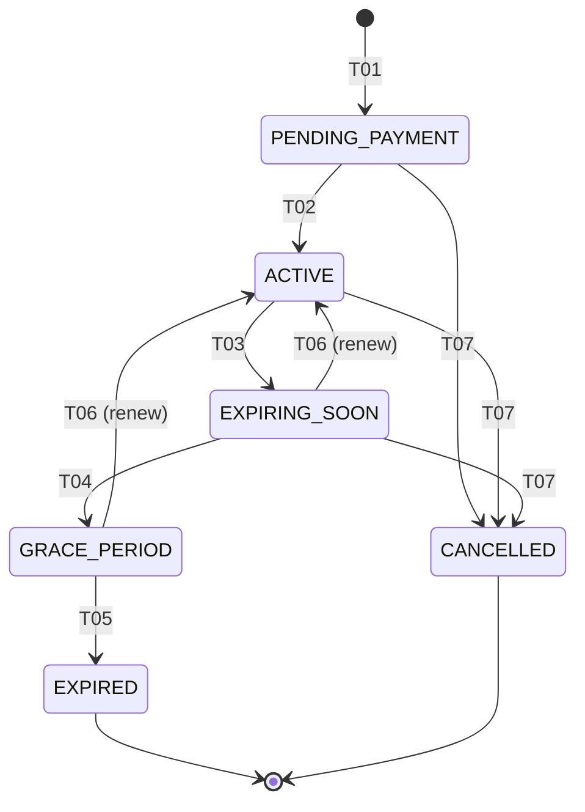

# State Machine — FarmSubscription

Subscription lifecycle covering purchase, payment, active, near-expiry warning, expiry, manual cancel, and renewal during grace period.

## States

| State | Description |
|---|---|
| `PENDING_PAYMENT` | Purchased but payment callback not received |
| `ACTIVE` | Paid, currently valid, write actions allowed |
| `EXPIRING_SOON` | Within 7 days of expiry; warning notifications sent |
| `GRACE_PERIOD` | Past expiry date but still within renewal grace window |
| `EXPIRED` | Past grace; write actions blocked but data preserved |
| `CANCELLED` | Manually cancelled by farm or admin before expiry |

## Transitions

| transition-id | from-state | to-state | triggered-by-role | trigger-event-or-api | guards | related-br |
|---|---|---|---|---|---|---|
| STM-SUB-T01 | (none) | PENDING_PAYMENT | farm_manager | POST /api/v1/farm-subscriptions | BR-SUB-010 | BR-SUB-010 |
| STM-SUB-T02 | PENDING_PAYMENT | ACTIVE | system | event: PaymentCallbackVerified | BR-SUB-020 | BR-SUB-020 |
| STM-SUB-T03 | ACTIVE | EXPIRING_SOON | system | scheduled: 7 days before expiry | BR-SUB-030 | BR-SUB-030 |
| STM-SUB-T04 | EXPIRING_SOON | GRACE_PERIOD | system | scheduled: at expiry timestamp | BR-SUB-040 | BR-SUB-040 |
| STM-SUB-T05 | GRACE_PERIOD | EXPIRED | system | scheduled: end of grace window | BR-SUB-050 | BR-SUB-050, BR-SUB-060 |
| STM-SUB-T06 | EXPIRING_SOON, GRACE_PERIOD | ACTIVE | farm_manager | POST /api/v1/farm-subscriptions/{id}/renew | BR-SUB-070 | BR-SUB-070 |
| STM-SUB-T07 | PENDING_PAYMENT, ACTIVE, EXPIRING_SOON | CANCELLED | farm_manager, admin | POST /api/v1/farm-subscriptions/{id}/cancel | BR-SUB-080 | BR-SUB-080 |

## Diagram

## Valid End States

- `EXPIRED`
- `CANCELLED`
