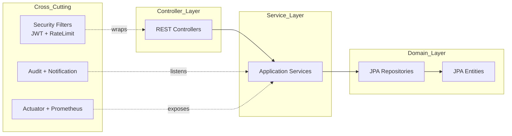
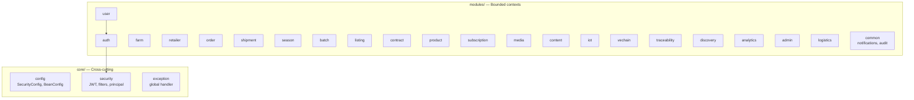

# Architecture — Component View

C4 Level 3: backend internal modular structure. Migrated content from `docs/architecture/BACKEND_ARCHITECTURE.md` (legacy) + `BLOCKCHAIN_ARCHITECTURE.md`.

## Modular Monolith Layout



## Backend Module Map

22 bounded-context modules under `backend/src/main/java/com/bicap/modules/`. Index in [`../04-modules/README.md`](../04-modules/README.md). Cross-cutting infrastructure under `backend/src/main/java/com/bicap/core/`.



## Layered Module Convention

Each domain module follows a layered structure (per AGENTS.md):

```text
backend/src/main/java/com/bicap/modules/<module>/
├── controller/   HTTP/API boundary
├── dto/          request/response contracts
├── service/      application/business rules
├── entity/       persistence models
├── repository/   database access
└── enums/        lifecycle/status values
```

Business rules MUST live in services, not controllers.

## Cross-Cutting Components

### Security stack

- `JwtTokenProvider` — issue + validate JWT
- `JwtAuthenticationFilter` — read header, populate `SecurityContext`
- `CustomUserDetailsService` — load user + roles
- `RateLimitFilter` — protect sensitive endpoints
- `SecurityConfig` — `@PreAuthorize` enabled, `permitAll` for public endpoints listed in [`../05-api/authentication.md`](../05-api/authentication.md)

### Observability

- Spring Actuator: `/actuator/health/*`, `/actuator/metrics`, `/actuator/prometheus`
- Audit logging via `common/audit`
- See [`../07-operations/observability.md`](../07-operations/observability.md)

### VeChainThor Integration

Primary integration through `modules/vechain` and `modules/traceability`:

- `TraceabilityProofService` — interface used by domain services (season, batch, etc.)
- `VeChainTraceabilityProofService` — production implementation, delegates to:
- `VeChainProofService` — low-level commit/track operations
- `BlockchainTransaction` entity persists tx metadata (status: PENDING, SUCCESS, FAILED, GOVERNED, RETRY_SCHEDULED)
- Admin governance API validates readiness without exposing private keys (per [`BR-VCH-010`](../02-domain/business-rules.md))

[`GAP-001`](../09-governance/gap-register.md): Brief Admin requires deploy/update of smart contracts; current implementation only validates/manages. Resolution pending product decision.

## Response Format Convention

All API responses use `ApiResponse<T>` envelope:

```json
{
  "success": true,
  "code": "200",
  "message": "OK",
  "data": { },
  "errors": null,
  "timestamp": "2026-05-16T03:00:00Z"
}
```

Error envelope per [`../05-api/conventions.md`](../05-api/conventions.md).

## Database

- MySQL 8.4 via JDBC
- Schema managed by Flyway: `backend/src/main/resources/db/migration/V*__*.sql`
- Optimistic locking via `@Version` (see "Known DB Schema Issues" in `AGENTS.md`)
- Demo seed in `V2__seed_phase2_core_data.sql` and follow-up V22, V24

## Tech Stack

See [`tech-stack.md`](tech-stack.md) for pinned versions.
