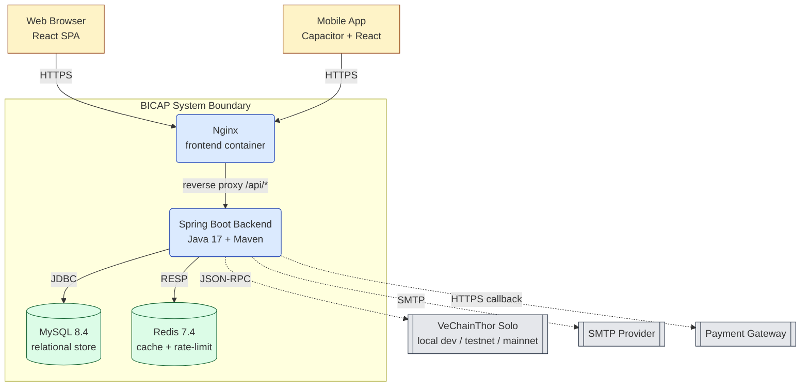

# Architecture — Container View

C4 Level 2: containers (deployable units) inside the BICAP system boundary, with their primary technology choices. Migrated content from `docs/architecture/ARCHITECTURE.md` (legacy).

## Diagram

## Containers

| Container | Tech | Purpose | Source |
|---|---|---|---|
| Frontend (Nginx) | Nginx + React static build | Serve SPA, reverse proxy `/api` | `frontend/Dockerfile`, `frontend/nginx.conf` |
| Backend | Spring Boot (Java 17) | Business logic, RBAC, blockchain commits | `backend/Dockerfile`, `backend/pom.xml` |
| MySQL | MySQL 8.4 | Relational persistence | `docker-compose.yml` |
| Redis | Redis 7.4 | Cache + rate limiting | `docker-compose.yml` |
| VeChainThor | `ghcr.io/vechain/thor:v2.1.0` (local solo) | Blockchain proof commits | `docker-compose.yml` |

## Health Endpoints

- Backend: `GET /actuator/health/readiness`, `GET /actuator/health/liveness`
- Frontend: `GET /healthz`
- MySQL: `mysqladmin ping`
- Redis: `redis-cli ping`
- VeChainThor: `GET /blocks/best`

All wired into `docker-compose.yml` healthchecks.

## Key Boundaries

- Frontend never speaks to MySQL/Redis directly; all traffic goes through backend.
- Backend never returns private blockchain signing keys ([`BR-VCH-010`](../02-domain/business-rules.md)).
- Public endpoints (login/register/refresh, public marketplace, public trace) skip JWT but go through rate limiter.
- Authoritative authorization is server-side (per [`ADR-003`](adrs/ADR-003-jwt-stateless-auth.md) + design D5).

## Environment Profiles

- `local` — developer machines (used by `docker-compose.yml`)
- `test` — CI isolated runs
- `staging` — pre-prod env-only config
- `prod` — live deployment (`docker-compose.prod.yml`, `deploy/k8s/`)

See [`deployment.md`](deployment.md) for deployment topology.
