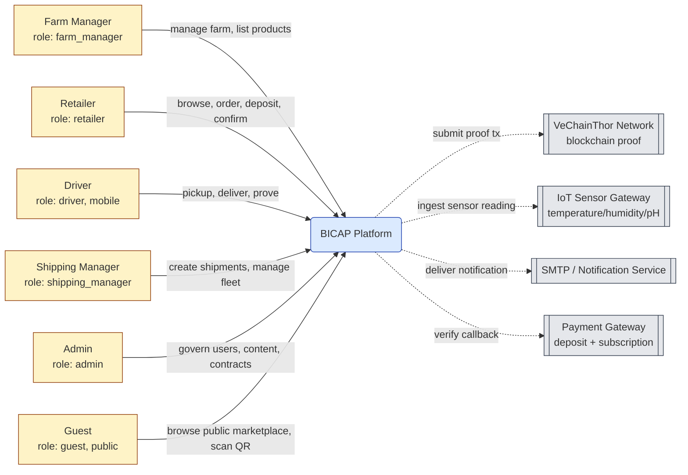

# Architecture — System Context

C4 Level 1 view of BICAP. Shows the system in scope, the personas using it, and external systems it integrates with. Per design D14 the diagram uses plain mermaid `flowchart` with C4-style class definitions.

## Mission

BICAP is a role-based agricultural supply-chain platform for managing farm production, product traceability, marketplace listing, retailer ordering, shipment handoff, driver proof, admin governance, and public/guest discovery. The accepted architecture is **Modular Monolith + Layered Modules + RBAC Frontend**.

## Personas

Six in-scope roles (see [`stakeholders.md`](../00-overview/stakeholders.md)):

- Admin
- Farm Manager
- Retailer
- Shipping Manager
- Driver (mobile app)
- Guest (web/mobile)

## Diagram

## Architecture Stack

| Layer | Choice | Pinned in |
|---|---|---|
| Backend | Java 17 + Spring Boot 3.2.5 | `backend/pom.xml` |
| Frontend | React 18 + Vite 8 | `frontend/package.json` |
| Database | MySQL 8.4 + Flyway migrations | `docker-compose.yml`, `pom.xml` |
| Cache | Redis 7.4 | `docker-compose.yml` |
| Blockchain | VeChainThor (canonical) | [`adrs/ADR-002-vechainthor-canonical-chain.md`](adrs/ADR-002-vechainthor-canonical-chain.md) |
| Auth | JWT stateless | [`adrs/ADR-003-jwt-stateless-auth.md`](adrs/ADR-003-jwt-stateless-auth.md) |
| Observability | Spring Actuator + Prometheus | `pom.xml` |

## Quality Bar

A change is not complete unless:

- RBAC behavior remains correct (per [`../06-security/rbac-matrix.md`](../06-security/rbac-matrix.md)).
- State machine transitions follow [`../02-domain/state-machines/`](../02-domain/state-machines/).
- Frontend tests/build pass for touched areas.
- Backend tests pass or targeted backend tests validate the module.
- Module docs stay synchronized with behavior (per `04-modules/`).

## Documentation Map

- [`MODULES`](../04-modules/README.md) — module index
- [`business-rules.md`](../02-domain/business-rules.md) — atomic BR catalog
- [`agents-md-amendment.md`](../09-governance/agents-md-amendment.md) — Doc-Code Sync Protocol
