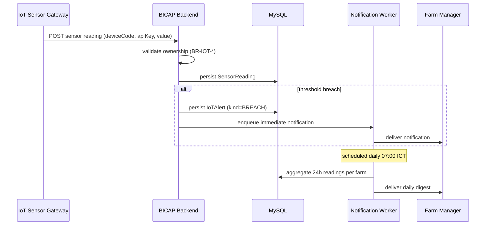

# IoT

## Purpose

IoT module sở hữu sensor data ingestion (nhiệt độ, độ ẩm, pH), IoT alerts, và notification cadence cho farm owners.

## Owns

- **R-\***: pending — `R-FRM-200` (nhận thông báo IoT trong ngày)
- **BR-\***: `BR-IOT-010` (sự kiện vượt ngưỡng → IoTAlert + notification per cadence dưới đây) — referenced trong design D4
- **STM-\***: none (per design D4: IoT alerts là notification rule, không phải state machine)

## Implements

- **Backend package:** `backend/src/main/java/com/bicap/modules/iot/`
- **Controllers:** `IoTController` (`/api/v1/iot`)
- **Related entities:** `SensorReading`, `IoTAlert`
- **Frontend route:** `/farm/iot`

## Depends-on

- farm, batch, season, common

## Cadence

Per design D4 (resolved [`GAP-007`](../09-governance/gap-register.md)). Hai trigger rules:

1. **On-threshold breach** (immediate). Sensor reading vượt ngưỡng cấu hình → tạo `IoTAlert` + đẩy notification ngay.
2. **Scheduled daily summary** (07:00 ICT theo timezone của farm). Tổng hợp toàn bộ readings 24h trước → gửi 1 digest dù không có breach.

"Trong ngày" trong Brief = per-day cadence, bao gồm cả breach event lẫn daily digest.

## Sequence Diagram

## API surface

- pending Stage 5 — IoT ingest endpoints (out of scope cho spec hiện tại; defer to `docs-openapi-completion`)

## Tests

- pending — cross-farm ingest rejection tests
- pending — gateway key validation tests

## Open gaps

- pending — gateway key rotation policy
