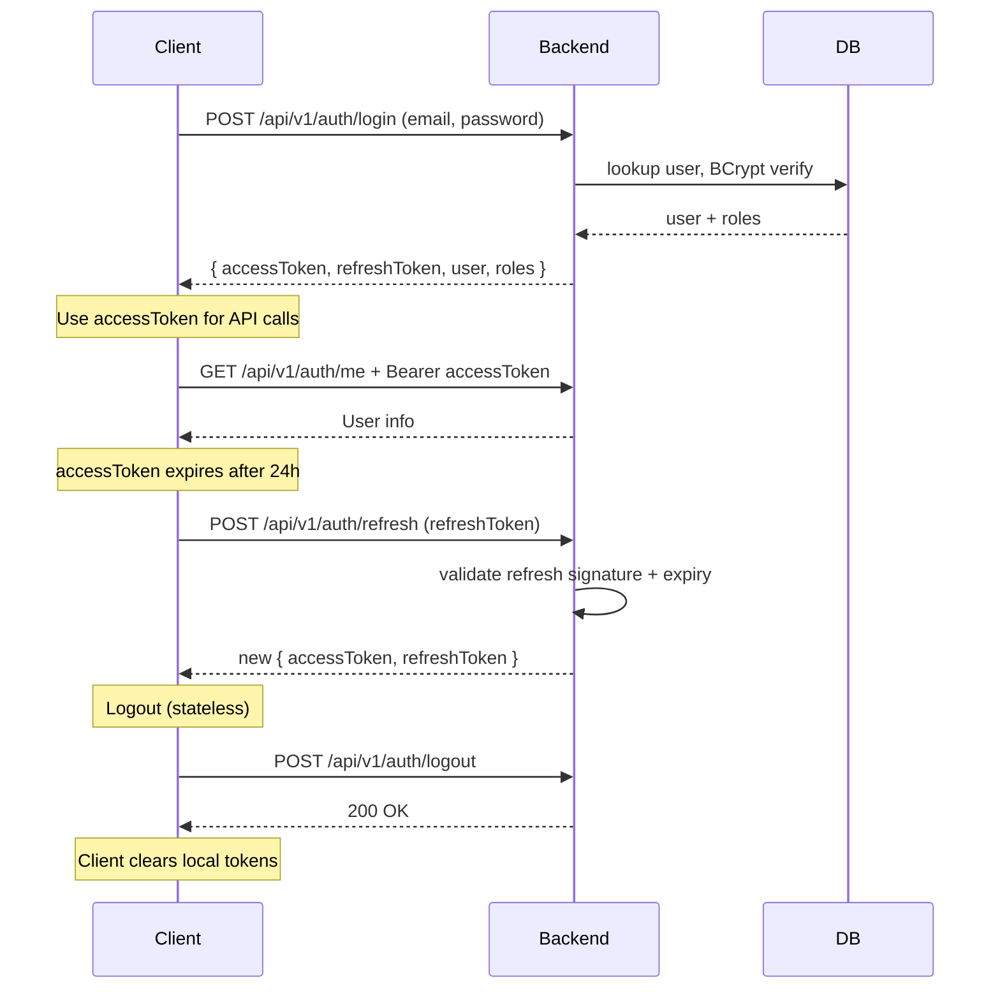

# API Authentication

JWT bearer authentication. See [`../03-architecture/adrs/ADR-003-jwt-stateless-auth.md`](../03-architecture/adrs/ADR-003-jwt-stateless-auth.md) for the architecture decision.

## Bearer Auth Scheme

OpenAPI security scheme (per [`openapi.yaml`](openapi.yaml)):

```yaml
securitySchemes:
  bearerAuth:
    type: http
    scheme: bearer
    bearerFormat: JWT
```

Client sends:

```
Authorization: Bearer <jwt>
```

Backend filter (`JwtAuthenticationFilter`) reads, validates, populates `SecurityContext`.

## Token Lifecycle

| Token | Default TTL | Configurable | Usage |
|---|---|---|---|
| Access token | 24h | `APP_JWT_EXPIRATION_MS` | `Authorization: Bearer <access>` |
| Refresh token | 7d | `APP_JWT_REFRESH_EXPIRATION_MS` | `POST /api/v1/auth/refresh` body |

Token claims:

```json
{
  "sub": "user@example.com",
  "userId": 123,
  "roles": ["ROLE_FARM"],
  "type": "access",
  "iat": 1715000000,
  "exp": 1715086400,
  "jti": "uuid-v4"
}
```

`type` = `access` or `refresh`. Backend rejects refresh token at access-protected endpoints and vice versa.

## Refresh Flow



## Public Endpoints

These endpoints do NOT require `bearerAuth`:

- `POST /api/v1/auth/register`
- `POST /api/v1/auth/login`
- `POST /api/v1/auth/refresh`
- `GET /api/v1/public/listings` (guest marketplace)
- `GET /api/v1/public/trace/*` (public QR trace)
- `GET /actuator/health/*` (probes)
- `GET /actuator/prometheus` (metrics scraping)

All other endpoints under `/api/v1/*` require bearer.

## Role Authority

JWT `roles` claim contains Spring Security authorities (prefix `ROLE_`):

- `ROLE_ADMIN`
- `ROLE_FARM`
- `ROLE_RETAILER`
- `ROLE_SHIPPING_MANAGER`
- `ROLE_DRIVER`
- `ROLE_GUEST`

Backend `@PreAuthorize` checks against [`../06-security/rbac-matrix.md`](../06-security/rbac-matrix.md). Conditional cells (`conditional:BR-*`) evaluated server-side via service-layer guards.

## Logout

Stateless. Backend returns 200 OK; client clears local token storage. Token is still cryptographically valid until expiry. For revocation, see follow-up gap (currently not implemented).

## Rate Limiting

`POST /api/v1/auth/login`, `POST /api/v1/auth/register`, password reset endpoints are rate-limited via `RateLimitFilter`. See [`../03-architecture/component.md`](../03-architecture/component.md).

## Password Policy

- Minimum 6 characters (validated server-side)
- BCrypt hashing (cost factor configured in `SecurityConfig`)
- Password hash never returned in API responses ([`BR-AUT-010`](../02-domain/business-rules.md))

## Demo Accounts (local only)

Per `README.md` and migration `V24__synchronize_demo_passwords.sql`:

| Email | Role | Password |
|---|---|---|
| `admin@bicap.com` | ADMIN | `123456` |
| `farm@bicap.com` | FARM | `123456` |
| `retailer@bicap.com` | RETAILER | `123456` |
| `manager@bicap.com` | SHIPPING_MANAGER | `123456` |
| `driver@bicap.com` | DRIVER | `123456` |
| `guest@bicap.com` | GUEST | `123456` |

Demo credentials are local-only; production deployments MUST disable demo seed and use environment-managed credentials.
