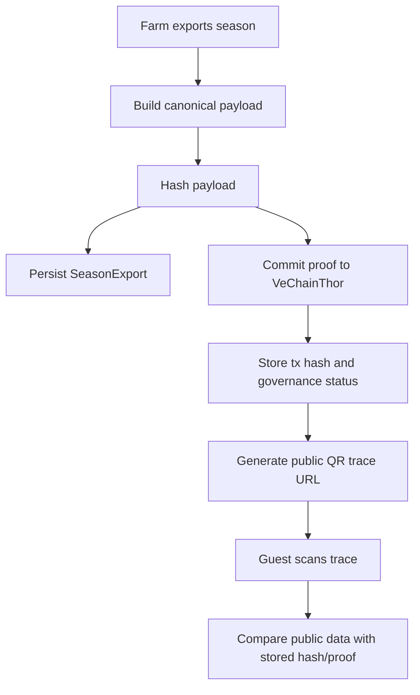

# Blockchain Proof Flow

## Purpose

BICAP uses blockchain as an integrity proof layer for clean agricultural traceability. The platform does **not** store full business records on-chain. Instead, it stores deterministic hashes and transaction identifiers so exported agricultural data can be verified as unchanged.

> [!IMPORTANT]
> The official blockchain proof layer for BICAP is **VeChainThor** through `VeChainProofService`.

## Flow

## What Goes On-Chain

- Trace code
- Canonical data hash
- Proof payload marker, for example `BICAP|SEASON_EXPORT|...`
- VeChainThor transaction metadata

## Service Boundary

Business services now call `TraceabilityProofService` instead of directly coordinating blockchain clients.

- `TraceabilityProofService` defines the proof contract.
- `VeChainTraceabilityProofService` is the official VeChainThor-backed implementation.
- `VeChainProofService` remains the low-level VeChain commit/track adapter.
- `BlockchainService` remains available for generic/legacy hash and queue behavior.

This makes the final defense architecture clearer: **business flow → traceability proof abstraction → VeChainThor implementation**.

## IoT Gateway Identity Hook

IoT ingest supports optional gateway identity fields:

- `deviceCode`
- `apiKey`
- `gatewayTimestamp`

Current low-risk production hook verifies supplied device credentials using a deterministic farm/device key contract while preserving JWT-based farm/admin ingest compatibility. A future full production version can replace the deterministic verifier with a persistent `IoTDevice` registry.

## What Stays in Database

- Farm, season, product, batch and process details
- Public trace DTO fields
- Governance status and retry metadata
- QR image data

## Failure Behavior

Blockchain submission is intentionally non-fatal:

1. Business data remains saved in PostgreSQL.
2. Failed blockchain commits are recorded as `FAILED` governance transactions.
3. Admin can inspect/retry through blockchain governance APIs.

This protects operational continuity while preserving auditability.

## Legacy/Generic Adapter Note

`BlockchainService` contains generic hash/Web3j-style helper behavior used by older batch flows. For final demonstration, the canonical proof path should be explained as:

> Season export → canonical hash → `VeChainProofService` → VeChainThor transaction → public QR trace.

Long-term production refactor recommendation: introduce a single `TraceabilityProofService` abstraction with `VeChainTraceabilityProofService` as the primary implementation.
